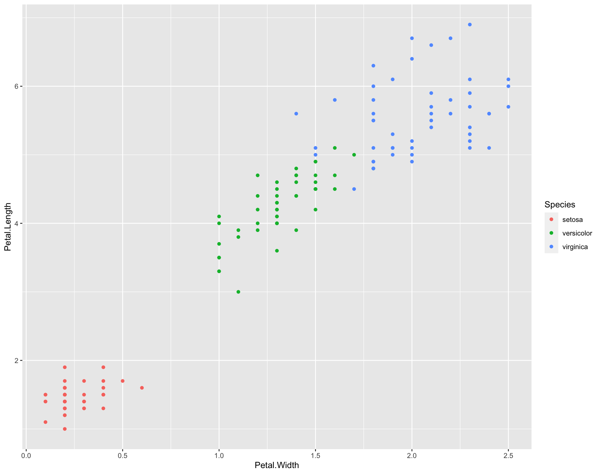

```{r setup, include = FALSE}
knitr::opts_chunk$set(comment = "",
                      fig.align = 'center',
                      out.width = "75%")
```

In our previous lesson, we used the ***packages*** to load functions in R to create, manipulate, and filter data. Today, we'll be introducing the [`tidyverse`](https://www.tidyverse.org/) which is a collection of ***packages*** that "*share an underlying design philosophy, grammar, and data structures.*" The `tidyverse` methods we use today will perform the same tasks as those we covered in the previous lesson (*redundancy is a common theme in data science*); however, in many cases the `tidyverse` ***packages*** can be a bit more intuitive.

We'll focus on two major components of coding with the `tidyverse` in R: 1. Introduce `tidyverse` packages, functions, and grammar 2. Data visualization with `ggplot2`

The contents of today's lesson closely follows those detailed in Chapters 3, 5, and 9 of [`R for Data Science`](https://r4ds.hadley.nz/layers).

------------------------------------------------------------------------

## 1. `tidyverse` grammar

We've already learned about loading ***packages*** that give us access to functions and data relevant to our objectives. However, one of the strengths of R is access to a huge collection of ***packages*** purpose-built to help analyze your data.

### 1.1 Download and installing `tidyverse`

Thanks to R's long legacy in data science (and continued development), you'll find that there's an extremely rich corpus of ***packages*** that can be used to analyze data (e.g., [bioconductor](https://www.bioconductor.org/about/)). However, these ***packages*** are often not automatically available in R and require download/installation before you can use them.

You can use the `install.packages()` command to download and install packages from CRAN. In the console below, you can use `install.packages("tidyverse")` to download an install the `tidyverse` package.

Once installed, use the following commands to load `tidyverse` (we use the `suppressPackageStartupMessages()` wrapper to prevent the display of messages about loading the package for cleaner setup, but this step is completely optional):

```{r, warning = FALSE, message = FALSE}

# Load tidyverse packages
library(tidyverse)

# Load tidyverse documentation
?(tidyverse)
```

The `install.packages()` ***function*** installs packages that are deposited on CRAN ("Comprehensive R Archival Network"). Although there are other repositories that store R ***packages,*** CRAN is the most common (followed by `GitHub` and `Bioconductor`). Most programs will provide instructions for their installation.

### 1.2 Overview of `tidyverse`

Now that we have `tidyverse` loaded into our environment, let's briefly discuss the component ***packages*** that are installed/loaded.

There are four major ***packages*** in the `tidyverse` that we'll be using throughout this lesson (though there are more installed with `tidyverse`, see [here](https://tidyverse.org/packages/)). Each of these packages is automatically loaded when you run `library(tidyverse)`.

-   `dplyr`: Intuitively accessing/manipulating ***data frames*** (or similarly-formatted objects)
-   `tibble`: An alternative format to ***data frame*** (less flexible, but more *readable*)
-   `tidyr`: Functions to assist in organizing/tidying tabular data (e.g., ***data frames***)
-   `ggplot2`: A flexible and powerful suite of potting tools

#### 1.2.1 Data frames in base R (refresher).

To begin, let's load some data and interact with it using base R techniques we've already covered.

```{r}

df <- as.data.frame(billboard) # Load the `billboard` data into a data frame object

```

**1.** In the console below, print `df`.

**2.** Print the first four columns of your data frame (remember the `[]` operators).

```{r}


```

**3.** Print the first four columns where the artist is "Eminem".

```{r}


```

#### 1.2.2 Dataframes with `tidyverse`.

Now, let's revisit the same tasks using `tidyverse` tools:

```{r}

df <- billboard 

```

`billboard` is a ***tibble object*** by default. Superficially, a ***tibble*** is very similar to a ***data frame*** and allows for simpler visualization (particularly in the ***console*** below). Though there are some nuanced differences between using ***tibbles*** and ***data frames***, we won't discuss them here. For now, they'll allow us to readily summarize large data sets, efficiently view them, and query the type of objects stored in a column.

1\. In the console below, print `df`.

2\. Print the first four columns of your ***data frame***.

```{r}

df %>% 
  select(1:4)

```

We've introduced a new ***operator***, `%>%`, which is called a "pipe". The `%>%` operator can be used to string together multiple commands, where the output from the previous ***function*** is the input for the next. Thus, the command above can be also written as `select(df, 1:4)`, but the `%>%` operator makes stringing many functions together more intuitive (in contrast to many nested functions).

The `select()` command *selects* columns (comparable to accessing columns with `[]`).

3\. Print the first four columns where the artist is "Eminem".

```{r}

df %>% 
  select(1:4) %>% 
  filter(artist == "Eminem")

```

The `filter()` command *filters* rows based on user-defined criteria -- many criteria can be provided to one `filter()` command.

### 1.3 Key `tidyverse` commands

Let's discuss a few powerful commands that are included in the `tidyverse`, then we'll work through an exercise practicing what we've learned. As a reminder, you can use `help()` or `?<function>` to get detailed information about a ***function***. If the output preview of the code block below is too small, repeat the task in the console below for an extended view of each command's output.

```{r}

df <- billboard # Load the `billboard` data to the `df` object

```

-   `select()` subsets a data frame by specifying columns of interest. You can specify columns by name, index, or by a pattern (e.g., `starts_with()`). You can negate a selection by using `!`. Note that you don't need to put `""` around a column name when using `select()` -- the function will format these arguments as strings behind-the-scenes.

```{r}

df %>% 
  select(artist, date.entered) %>%
  head()

```

```{r}

df %>% 
  select(1,3) %>%
  head()

```

```{r}

df %>% 
  select(!starts_with("wk")) %>%
  head() 

```

-   `filter()` subsets a data frame by specifying *filtering* criteria. Recall the logical operators we used in the last lesson (e.g., `==`, `>`, `&`, etc.); these can be used to specify the filtering criteria.

```{r}

df %>% 
  select(artist, track, date.entered) %>% 
  filter(artist == "Eminem")

```

```{r}

df %>% 
  select(artist, track, date.entered) %>% 
  filter(artist == "Eminem" & track == "Stan") 

```

-   `pivot_longer()` transforms a "*wide*" data frame to a "*long*" data frame. Long data frames are often easier (or at least more intuitive) to work with in `tidyverse`! You can also `pivot_wider()`, but we won't belabor this point here.

```{r}

df <- df %>%
  pivot_longer(cols = starts_with("wk"), # Specify columns to transform
              names_to = "week", # Specify the "names" column name
              values_to = "rank") # Specify the "values" column name

df <- df %>%
  filter(!is.na(rank))

head(df)

```

For the next few functions, we'll pivot to the `iris` data set.

```{r}

library(datasets)
df <- tibble(iris)

head(df)

```

-   `mutate()` creates a new column (or replaces a pre-exising one) using an expression provided by the user. This is a powerful function that can be used to combine information across columns, edit text, and convert data types.

```{r}

df <- df %>%
  mutate(Petal.Area = Petal.Length * Petal.Width,
         Sepal.Area = Sepal.Length * Sepal.Width)

df <- df %>%
  mutate(Species = paste("Iris", Species, sep="_"))

head(df)

```

-   `arrange()` sorts data by a specified column. By default, `arrange()` sorts in ascending order (smallest values at the top), but you can specify descending order by using `-` before the column name.

```{r}

df %>% 
  select(Species,Petal.Area,Sepal.Area) %>% 
  arrange(-Petal.Area) %>%
  head()

```

-   `summarise()` performs functions on a group of observations. This is often used in conjunction with the `.by` argument to specify the grouping variable.

```{r}

df %>% 
  summarise(PA.mean = mean(Petal.Area, na.rm = TRUE), # Compute the mean of Petal.Area
            SA.mean = mean(Sepal.Area, na.rm = TRUE), # Compute the mean of Sepal.Area
            .by = Species) # Compute means per unique value in the Species column

```

The functions described above are powerful, particularly when data sets grow large. With the `iris` data set example, imagine you are interested in identifying trends in flower anatomy. Though you've only directly measured "length" and "width", you can very quickly compute (e.g., using `mutate()`) metrics "area" or "ratio" to identify trends between species (e.g., using `summary()`). These same principles can be extended to genetic data, where there can be millions-to-billions of "A", "T", "C", and "G" observations that can be used to identify trends.

### 1.4 Practice

Now, let's work through an example. As the list of functions you've encountered has grown quite quickly during this lesson, I'll provide you a "function bank" below:

-   `select()` - Subset columns
-   `filter()` - Subset rows by column values
-   `mutate()` - Create/Edit columns
-   `arrange()` - Sort ***data frame*** by column values
-   `summarise()` - Perform ***functions*** on a group of observations (Note: `.by = <variable>` allows you to select the grouping variable)
-   `pivot_longer()` - Transform a "wide" ***data frame*** to a "long" ***data frame***

```{r}

# First, we'll load the data:
df <- starwars

```

With these data, modify the `df` object in the following tasks:

1.  Subset to: *name, height, mass, homeworld,* and *species*

```{r}


```

2.  Remove any rows where either *height* or *mass* is `NA` (remember the `is.na()` function)

```{r}


```

3.  Compute and create a column that contains the mass per unit height

```{r}


```

4.  Arrange your data such by the values in your new column (descending)

```{r}


```

With these reformatted data, address the following questions:

5.  Which character has the lowest mass per unit height?

```{r}


```

6.  Using `summarise()`, which *homeworld* has the greatest mean *mass*?

```{r}


```

7.  Using `summarise()`, which species has the greatest mean *mass*?

```{r}


```

In the example above, we used the `starwars` data set and `tidyverse` commands to transform the data to achieve the following: - Contain only the variables of interest - Compute new values "important" to our analysis - Make conclusions about our observations.

While intergalactic travel and alien species may not be the most immediately relevant topics to your research, the same techniques used above can be used to analyze real biological data!

Next, we'll work on visualizing our data with `ggplot2`.

------------------------------------------------------------------------

## 2. Data visualization with `ggplot2`

In addition to organizing data, another major pillar of data science is **visualization**. There are many reasons why data visualization is valuable to science, but I'll highlight some broader themes here:

1.  **Exploration of data** - *facilitate* *the identification of unanticipated trends/patterns*
2.  **Presentation of results** - *visualize results in support of a hypothesis/conclusion*
3.  **Science communication** - *generalize science to a format digestible by a target audience*

In this section of the workshop, we'll learn and practice plotting using `ggplot2`, a `tidyverse` ***package*** that uses the same grammar as we've been practicing above.

### 2.1 `ggplot2` basics

As with many `tidyverse` packages, `ggplot2` has [robust documentation](https://ggplot2.tidyverse.org/) to help users generate plots relevant to their data visualization needs. There are many common paradigms in data plotting (far too many to discuss here), but we'll start from the ground-up and focus on the basics.

To begin, let's start by setting up our environment and loading our example data:

```{r, message=FALSE}

library(tidyverse)
df <- tibble(iris)

```

Now that we're set up, let's try and recreate the following plot that was generated using `ggplot` and the `iris` data set:

{width="80%"}

First, we need to know precisely *what* is being plotted with `ggplot()`. Though there are many cosmetic elements to the plot above, we can summarise the aeshetics as the following:

1.  **x-axis** is *Petal.Width*
2.  **y-axis** is *Petal.Length*
3.  **color** is *Species*
4.  Data are presented as a scatter plot

We'll build this plot from the ground up. To start, we need to create a `ggplot` object that will organize the data for plotting and allow us to add layers to the plot (e.g., points, lines, boxes, etc.).

**Try running `ggplot(data = df)` in the console below.**

By itself, this function doesn't appear do much (or anything). However, behind the scenes it has created a complex object with the data and plot settings prepared. However, the command above is incomplete; we also need to tell `ggplot()` precisely what variables (columns) should be plotted (these are the plot's *aesthetic mappings*) and what type of plot (e.g., scatter plot, box plot, etc.) to create.

To plot these aesthetics, we need to add a *geometric object layer* to our plot. In this case, we want to create a scatter plot, which uses `geom_point()`. We'll combine this layer with the added *aesthetic mappings* below:

```{r}

ggplot(data = df,
       mapping = aes(x = Petal.Width,
                     y = Petal.Length)) +
  geom_point()

```

Note the `+` operator above! After we've created a `ggplot` object, we connect additional layers using `+`.

The only remaining element missing from our plot is to color the points by "Species". To do this, we simply need to add another `aes` to our `ggplot` object! To know what aesthetics are available to `geom_point()`, take a look at the function's documentation!

```{r}

ggplot(data = df,
       mapping = aes(x = Petal.Width, 
                     y = Petal.Length, 
                     color = Species)) +
  geom_point()

```

***You've reproduced the plot!***

If you choose to continue in biology you'll likely encounter studies which make their plotting code (and data-generation code) publicly available. **Reproducibility is very important to science!**

In the example above, you encountered the typical format for plotting with `ggplot`. There are many permutations of the plotting procedure above (we'll cover a few more below), but I'll summarize the most common steps in order below:

1.  Initialize a `ggplot` object using `ggplot` which takes two ***arguments:***
    a.  `data = <data frame>`: ***data frame*** containing values/variables to be plotted
    b.  `mapping = aes(<mappings>)`: ***name-value pairs*** (`aes`) of what should be plotted (e.g., `aes(x = Var1,y = Var2)`)
2.  Specify first plotting layer (i.e., the type of "geometric object" or `geom`)
3.  Specify additional layers (e.g., cosmetics, labels, and/or additional plots)

### 2.2 Expanding on the basics

Let's continue plotting using the same underlying data. We'll begin by adding a trend line to the plot:

```{r}

# Add a trend line for each category
ggplot(data = df,
       mapping = aes(x = Petal.Width,
                     y = Petal.Length,
                     color = Species)) +
  geom_point() +
  geom_smooth(method = "lm",
              formula = y ~ x)

```

Note that the trend line is added as a second layer on the plot *above* the scatter plot layer. This means that the points are plotted first, and then the trend line is plotted on top of the points. If we were to reverse the order of the layers, the trend line would be plotted first, and then the points would be plotted on top of the trend line! This is an important feature of `ggplot` - the order of the layers can impact the readability of the plot!

We also supplied the `method = "lm"` argument to `geom_smooth()`, which tells `ggplot` to fit a linear model to the data. We'll discuss linear models in a bit more detail in the next lesson.

Finally lets change some of the plotting labels and theme to make the plot more aesthetically pleasing:

```{r}

# Save plot as an object
g <- ggplot(data = df,
            mapping = aes(x = Petal.Width,
                          y = Petal.Length,
                          color = Species)) +
  geom_point() +
  geom_smooth(method = "lm",
              formula = y ~ x)

# Change labels and theme
g +
  labs(x = "petal width (cm)",
       y = "petal length (cm)",
       color = "species") +
  theme_minimal()

```

This example highlights the modularity of plotting data with `ggplot2`. In the examples above, we added lines to the pre-existing plotting code to change the output according to our intentions. This process of iterating on a plot isn't a contrived example either - this is commonly how plots are developed in R!

### 2.3 Practice

Let's practice what we've learned so far in the following exercise:

```{r}

# Create a new copy of the iris data set
df <- iris

```

**1.** For both sepals and petals variables, respectively, add columns (using `mutate()`) that compute the sepal and "petal areas ($\text{length} \times \text{width}$).

```{r}


```

**2.** Create a plot with the following features:

-   **x-axis** is *petal area*

-   **y-axis** is *sepal area*

-   [First]{.underline} geometric layer is a trend line (`geom_smooth`: use `method = "lm"` and `formula = y ~ x` arguments)

-   [Second]{.underline} geom layer is a scatter plot (`geom_point`)

```{r}


```

**3.** How would you describe the trend in your data? Does this trend change when you color by *Species*?

```{r}


```

As with all coding, your comfort with plotting in R will improve as you spend time with it. Just as you processed the data above to identify trends in flower anatomy, these same principles are widely applicable to a variety of sciences.

In the example above, we plotted the relationship between ***continuous variables*** (e.g., *petal width* and *petal length*) using a curve (`geom_smooth`) overlaid onto a scatter plot (`geom_point`). In the next section, we'll discuss and practice additional plot types that are better used for other formats of data.

### 2.4 Additional plotting tools

Variables are used to describe two major categories of data:

1.  **Continuous** - A variable that can be described along a continuum of quantitative values (e.g., `1:100`)
2.  **Categorical** - A variable with a discrete number of values (e.g., "Tall/Short")

In the example above, we plotted two ***continuous variables*** (*x* and *y*) as well as a single ***categorical variable*** (*color*). This plotting style works well for these data, as it allows us to visualize the relationship between the ***continuous variables*** while simultaneously grouping species by color. However, scatter plots are not the only plotting format available to us, and in some cases, other plotting formats may be more appropriate for visualizing the data.

Lets take a step back and take a look at some other common plotting styles and introduce some additional plotting tips/tricks.

#### 2.4.1 Histograms.

***Histograms*** are a valuable plotting format, as they allow you to visualize a distribution of values associated with a single variable. In particular, plotting a ***histogram*** can help you identify trends that can be used to inform future analyses. ***Histograms*** can also be used to directly describe your data; for example, two peaks in a ***histogram*** may suggest you're sampling from two distinct populations.

```{r}

# Load data
df <- iris

# Add a column for petal area
df <- df %>% 
  mutate(petal_area = Petal.Length * Petal.Width)

# Plot a histogram of petal area
ggplot(data = df,
       mapping = aes(x=petal_area)) +
  geom_histogram(binwidth = 1) + # What happens if you change the binwidth value?
  facet_wrap(~Species, nrow = 3) + # `facet_wrap` allows us to split our plot into panels
  theme_classic()

```

Try playing with the `binwidth` argument in `geom_histogram()` to see how it changes the plot. We also use `facet_wrap()` to create a plotting subpanel by *Species*, this allows us to visualize the distribution of petal area for each species separately.

#### 2.4.2 Box plots and violin plots.

***Box plots*** and ***violin plots*** are used to visualize distributions *within* categories of data. Whereas a ***box plot*** communicates quantiles of the data (take a look at the documentation for `geom_boxplot()`), ***violin plots*** communicate the distribution of the data and emphasize *modality*. These two plots are often used together to provide a more complete picture of trends within *categorical variables*.

Lets look at an example:

```{r}

## Box plot
ggplot(data = df,
       mapping = aes(x = Species,
                     y = petal_area,
                     fill = Species)) +
  geom_boxplot() +
  theme_classic() +
  theme(legend.position = "none") +
  labs(y = "Petal area")

```

```{r}

## Violin plot
ggplot(data = df,
       mapping = aes(x = Species,
                     y = petal_area,
                     fill = Species)) +
  geom_violin() +
  theme_classic() +
  theme(legend.position = "none") +
  labs(y = "Petal area")

```

```{r}

## Combined box + violin plot
ggplot(data = df,
       mapping = aes(x = Species,
                     y = petal_area,
                     fill = Species)) +
  geom_violin() +
  geom_boxplot(fill = "white",
               width = 0.025) +
  theme_classic() +
  theme(legend.position = "none") +
  labs(y = "Petal area")

```

### 2.5 `ggplot2` summary

We've only scratched the surface of plotting with `ggplot2`; if you'd like a resource to help guide you through producing a specific plot, take a look at their [cheatsheet](https://ggplot2.tidyverse.org/). As a reminder, we don't expect you to memorize all these tools and commands, but rather provide guidance on how they can be used in data analysis. In fact, leveraging online resources is common throughout an entire career of data science.

------------------------------------------------------------------------

## 3. Practice

We'll close out this lesson with a plotting exercise. I'll provide a ***function key*** below (as a reminder, you can use the `help()` ***function*** for more details)**:**

-   `ggplot(data = <data frame>, mapping = aes(<mappings>))`

    -   Common `aes` options: `x, y, color, fill`

-   `geom_histogram()`

    -   Common arguments: `binwidth = <int>`, `bins = <int>`

-   `geom_point()`

-   `geom_smooth(method="lm")`

-   `geom_boxplot()`

-   `geom_violin()`

-   `facet_wrap(~<variable>)`

    -   Common arguments: `ncol = <int>`,`nrow = <int>`

-   Common themes: `theme_minimal()`, `theme_classic()`, `theme_bw()`

```{r}

# Load data for exercise
# You can use `?mpg` to learn more about the data set
df <- mpg

```

Using these data, do the following:

1.  Familiarize yourself with the data. Which variables are ***continuous***/***categorical***?

```{r}


```

2.  Plot a histogram of *cylinder count* (what is the most common number of cylinders?)

```{r}


```

3.  Using `mutate`, compute the mean 'miles per gallon' (*mpg*) using the *cty* and *hwy* variables. Store your mutated ***data frame*** to a new ***object*** for the subsequent tasks.

```{r}


```

4.  Create a box plot capturing your mean *mpg* for each *manufacturer*. Which *manufacturer* has the highest mean *mpg*?

```{r}


```

5.  Faceting by *class*, plot *engine displacement* against your *mpg* measurements and add a trend line. Do any trends stand out?

```{r}


```

------------------------------------------------------------------------

**Congratulations!** We've completed the second lesson in our workshop! This lesson focussed on using ***packages*** contained within `tidyverse` to manipulate and visualize data. The techniques discussed throughout this lesson are fundamental to data analysis, and we encourage you to practice these techniques on your own data sets.

In the next lesson, we'll introduce you to some fundamentals of probability and statistics that you can use to make quantitative conclusions about your data.

------------------------------------------------------------------------

## 4. Recommended reading

For further reading on plotting in `ggplot2`, please see Chapters 9-11 in [R for Data Science (2e)](https://r4ds.hadley.nz/visualize).
