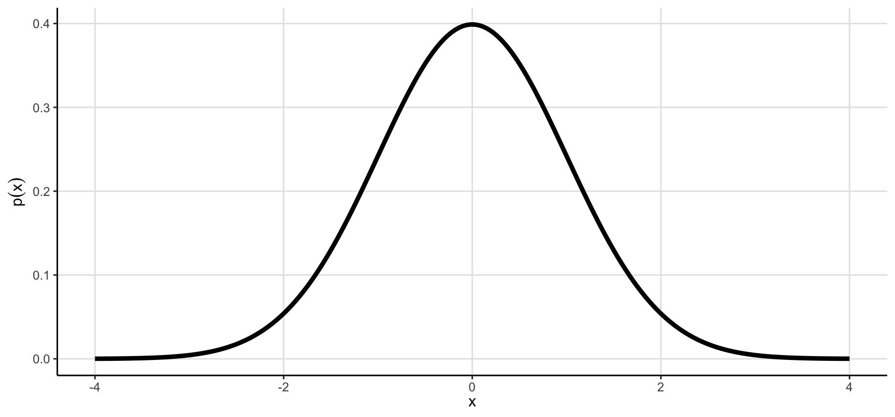

## JHU Biology REU 2026 - Probability and statistics

Today's lesson will focus on some basic concepts in ***probability*** and ***statistics***, which are essential for analyzing biological data and reaching reproducible conclusions, and how to implement these concepts/techniques in R. ***Statistics*** are fundamental component of science, providing a quantitative framework for analyzing data, testing hypotheses, and drawing conclusions. In biology, we often work with quite messy data, and statistics help us distinguish *signal* from *noise*, identify patterns, and make informed conclusions based on our data.

We will cover the following topics:

-   Normal probability distribution

-   Hypothesis testing (*t*-test)

-   Linear regression

We will only cover the basics here, focusing on flexible methods that are applicable across biological disciplines. For more in-depth knowledge on these subjects, I recommend reading [*Introduction to Statistical Learning*](https://www.statlearning.com/) by Gareth James, Daniela Witten, Trevor Hastie, and Robert Tibshirani.

------------------------------------------------------------------------

### 1. The normal distribution

There are many ***probability*** distributions that can be used to model different types of data. We won't be going deeply into the mathematical details of these distributions, but if you'd like to know more, take a look at [this website](https://www.acsu.buffalo.edu/~adamcunn/probability/probability.html) hosted by Adam Cunningham at the University of Buffalo.

One of the most common distributions used in biology is the ***normal distribution***, which is often used to model continuous data that are expected to be symmetrically distributed around a mean. The normal (or Gaussian) distribution is the classic "bell curve". For example, a common null hypothesis in biology is that morphometric traits (e.g., height or weight) is normally distributed.



In the plot above, the x-axis captures the distribution of random observations and the y-axis describes the probability of observing a particular value -- this is the probability density function (PDF) of the normal distribution. We can use this information to ask questions about our data. For example, we can ask: "What is the probability of observing a value greater than or equal to 1.0?" We will address this type of question below.

#### 1.1 The normal distribution parameters

The ***normal distribution*** is defined by two parameters:

-   The **mean** ($\mu$), which represents the average value of the distribution.

-   The **standard deviation** ($\sigma$), which represents the spread of the distribution around the mean.

Shorthand, you may see the normal distribution represented as $N(\mu, \sigma^2)$, where $\sigma^2$ is the variance (the square of the standard deviation).

In R, we can use the `rnorm()` function to generate random values from the normal distribution. As always, you can use `?rnorm` to learn more about this function. Below, we'll generate 1000 random values from $N(\mu = 0, \sigma^2 = 1)$ and plot the distribution as a histogram:

```{r}

# Load necessary libraries
library(tidyverse)

# Set seed for reproducibility
set.seed(420)

# Generate 1000 random values from a normal distribution
dat <- rnorm(n = 1000,
             mean = 0,
             sd = 1)

# Plot our data
tibble(dat) %>%
  ggplot(mapping = aes(x = dat)) +
  geom_histogram(bins = 100) +
  theme_minimal() +
  labs(x = "value")
```

Qualitatively, this distribution *looks* normal, and while there are formal test for normality (e.g., Shapiro-Wilk test), visual inspection is sufficient here. But how do we use the normal distribution to make *inferences* about our data? To address this question, let's return to the `iris` data set.

#### 1.2 Calculating probability from the normal distribution

Imagine that we have an incomplete record of $x = 4.0 cm$ associated with the `Petal.Length` variable, but no information on which of the species it belonged to. We want to calculate the probability of observing the value of $x$ for this incomplete record in each species, then ask, "Which species did this incomplete record come from?"

To do this, we will use the `qnorm()` function to calculate the probability of observing a value $x = 4.0$ for each species:

```{r}
# Load the iris data set and set our value of x
df <- iris
x <- 4.0

# Calculate the mean and standard deviation of Petal.Length for each species
prob.df <- df %>%
  group_by(Species) %>%
  summarise(mean = mean(Petal.Length),
            sd = sd(Petal.Length))

# Calculate the probability of observing a value x for each species
prob.df <- prob.df %>%
  mutate(prob = dnorm(x, mean = mean, sd = sd) %>%
           round(digits = 3))

prob.df
```

From the values above, we can see that the probability of observing $x = 4.0cm$ is the highest for the *versicolor* species ($p(x) = 0.728$). While there are more formal methods for classifying samples (e.g., logistic regression, or linear discriminant analysis), this relatively simple example illustrates how we can use the normal distribution to provide quantitative answers to questions about our data.

#### 1.3 Practice with the normal distribution

Below, we'll simulate body weight measurements for [domestic cats](https://avmajournals.avma.org/view/journals/javma/255/2/javma.255.2.205.xml) and ask the question, "What is the probability of observing a 6kg cat?"

```{r}
set.seed(150)

# 1. Simulate 1000 cat weights with a mean of 4.93 and a standard deviation of 1.4
# 2. Calculate the probability of observing a cat that weighs ≥ 6.0kg
# 3. Plot the distribution of simulated cat weights as a histogram and add a vertical line at 6.0kg (using `geom_vline(xintercept = 6.0)`)

```

### 2. Hypothesis testing

**Hypotheses** are statements that describe a phenomenon/observation, and a good hypothesis should be testable, falsifiable, and specific.

For example:

-   "*The genetic variant at locus X is associated with an increased risk of skin cancer.*"

-   "*The mean body weight of cats is less than 10kg.*"

-   "*The leaves of plant species A are longer than plan species B.*"

Developing a simple and elegant hypothesis takes practice and is a critical step to the scientific process (whether it's during experimental design or writing grant proposals, you'll encounter hypothesis development frequently).

There are many different statistics that can be used for hypothesis testing, and plenty of guidance on which tests are appropriate for the questions you're trying to answer (see [this article](https://statsandr.com/blog/what-statistical-test-should-i-do/) by Antoine Soetewey for an overview). Here, we'll focus on one of the most common tests: the ***t*****-test**.

#### 2.1 Performing a t-test

##### 2.1.1 The Palmer Penguins data set

The ***t*****-test** is a statistical test used to compare the means of two groups. To get an intuition for what a *t*-test specifically tests, let's simulate some data using a new biological dataset: `palmerpenguins`.

```{r}
install.packages("palmerpenguins", quiet = TRUE)
library(palmerpenguins)

df <- penguins
head(df)
```

Much like ***functions***, data sets that are distributed as R packages can also have documentation. Try running `?penguins` to learn more about this data set.

Next, let's subset our data and plot the distributions of body mass for two species of penguin: *Adelie* and *Gentoo*. Note the use of the `%in%` operator in the `filter()` function below. This operator allows us to filter for multiple values in a single column -- specifically testing whether the value in the `species` column is contained in the vector `c("Adelie", "Gentoo")`.

```{r}

# Create plot
g <- df %>% 
  filter(species %in% c("Adelie", "Gentoo"),
         !is.na(body_mass_g)) %>%
  ggplot(mapping = aes(x = body_mass_g, fill = species)) +
  geom_histogram(binwidth = 100, 
                 alpha = 0.5, 
                 position = "identity") +
  theme_minimal() +
  labs(x = "body mass (g)",
       y = "number of penguins",
       fill = "species")

# Print plot
g

```

From the plot above, we *qualitatively* observe that these two penguin species likely possess two distinct mass distributions, with *Gentoo* penguins being heavier than *Adelie* penguins. But how can we *quantify* this observation? This is where the *t*-test comes in.

##### 2.1.2 Student's t-test for body mass

The *t*-test allows us to test the ***null hypothesis*** that the two groups possess [equal means]{.underline}. Thus, the ***alternative hypothesis*** is that the two groups possess [unequal means]{.underline}. While we won't go into the details of the *t*-test formula or assumptions here, you can learn more about them in Danielle Navarro's [`Learning Statistics in R`](https://learningstatisticswithr.com/).

To perform a *t*-test in R, we can use the `t.test()` function. We'll be specifying the flag `var.equal = FALSE` to perform a Welch's t-test, which does not assume equal variances between the two groups (this is a more conservative test than Student's t-test, which assumes equal variances between groups).

```{r}

# Create vectors of body mass for each species
adelie <- df %>%
  filter(species == "Adelie") %>%
  pull(body_mass_g)

gentoo <- df %>%
  filter(species == "Gentoo") %>%
  pull(body_mass_g)

# Perform two-sample (Student's) t-test
t.test(adelie, gentoo, var.equal = FALSE)

```

The `t.test()` function outputs several important values, but we're going to focus on the *p*-value, which is *the probability of observing the test statistic (or more extreme) assuming the null hypothesis is true*. In this case, it is the probability of observing the difference in mean body mass between *Adelie* and *Gentoo* penguins (or a more extreme difference) assuming that the true mean body mass of these two species is equal.

The *p*-value is very small ($p < 0.001$), which provides evidence that our null hypothesis of equal means is unlikely to be true. Thus, we reject the null hypothesis. The *p*-value is an important concept in statistics and hypothesis testing -- we won't dwell on the specifics of how a *p*-value is calculated here, but I again encourage you to check out Danielle Navarro's [`Learning Statistics in R`](https://learningstatisticswithr.com/) for a more detailed summary.

#### 2.2 Practice with t-test

Below, we'll test whether Adelie on Biscoe island possess a different mean body mass than Adelie penguins on Dream island. As a reminder, here are some important functions (remember, you can use `?<function>` to open documentation):

-   `t.test()`: performs a t-test
-   `ggplot(data = ..., mapping = aes(...))`: creates a ggplot object
    -   `geom_histogram(alpha = ..., position = ...)`: creates a histogram layer
    -   `geom_vline(xintercept = ...)`: adds a vertical line to a plot at the specified x-intercept

```{r}

df <- penguins

# 1. Create two vectors of body mass:
## - Adelie penguins sampled on Biscoe Island
## - Adelie penguins sampled on Dream Island

# 2. Perform a two-sample Welch's t-test to compare the mean body mass of these two groups

# 3. Plot the distribution of body mass for these two groups as a histogram and add vertical lines at the mean body mass for each group
# Hint: You can use two separate `geom_vline()` layers to add vertical lines for each group once you know the means.


```

### 3. Linear regression

***Linear regression*** is a very powerful and flexible statistical tool for both inference (e.g., *What is the relationship between* $x$ and $y$?) and prediction (e.g., *How accurately can I predict* $y$ given some new value of $x$?).

Examples of linear regression in biology are the following:

-   Testing for associations between genetic variants and disease risk (i.e., genome-wide association studies, or *GWAS*)
-   Testing for changes in gene expression under different conditions (i.e., differential gene expression)
-   Testing for associations between genetic variants and gene expression (i.e., expression quantitative trait loci, or *eQTL* mapping)

In the most simple terms, ***linear regression*** uses a statistical technique called *least squares* to fit a line to a set of data points. This line is minimizes the *sum of squared distances* between the observed data and the predicted data (the line). This strategy simultaneously allows us to test for a correlation (and effect) between our $x$ and $y$ variables, while also empowering prediction.

There are **many** extensions of linear regression that can be used to model more complex relationships or use alternative fitting strategies. While these subjects are very interesting, they're sadly outside the scope of this workshop. Again, I highly recommend [Introduction to Statistical Learning](https://www.statlearning.com/) as a pragmatic and approachable introduction to these topics.

An important piece of advice for any statistical tool: ***Never use a statistical technique without first knowing its assumptions, limitations, and interpretations!***

#### 3.1 Linear regression on simulated data

##### 3.1.1 Simulating data

To provide an intuition of how ***linear regression*** works, we'll be begin by simulating two data sets: one with a strong linear relationship between $x$ and $y$, and one without a pre-defined relationship between $x$ and $y$.

Some important terminology before we get started:

1.  **Response variable**: This is the variable we're trying to predict (i.e., $y$)
2.  **Predictor variable**: This is the variable we're using to make predictions (i.e., $x$); note that you can have multiple predictors in linear regression, but we'll only use one for simplicity.

```{r}
# Set random seed for reproducibility
set.seed(500)

# Simulate x and y with a known dependency of y on x
df.strong <- data.frame(x = rnorm(n = 100, mean = 50, sd = 5)) %>%
  mutate(y = 50 + (2*x) - rnorm(n = 100, mean = 0, sd = 10))
    
# Simulate x and y without any dependency     
df.null <- data.frame(x = rnorm(n = 100, mean = 50, sd = 5),
                      y = rnorm(n = 100, mean = 10, sd = 10))

```

The `df.strong` data uses a linear model with the form $y = 50 + 2x$ and an additional error term defined by `rnorm()` to introduce some noise into the data. In contrast, `df.null` simulates $y$ independently of $x$.

##### 3.1.2 Plotting simulated data

Now that we've simulated our data, let's plot these data to visualize any trends prior to performing linear regression. We will also use a new library to plot multiple panels simultaneously: `patchwork`.

```{r}
# Install new library
install.packages('patchwork')
library(patchwork)

# Generate the plots
g.strong <- df.strong %>%
  ggplot(mapping = aes(x = x, y = y)) +
  geom_point() +
  theme_minimal() +
  labs(x = "x", y = "y", title = "Strong linear relationship")

g.null <- df.null %>%
  ggplot(mapping = aes(x = x, y = y)) +
  geom_point() +
  theme_minimal() +
  labs(x = "x", y = "y", title = "No linear relationship")

# Plot the two panels side-by-side usign the `patchwork` syntax
(g.strong | g.null)

```

##### 3.1.3 Performing linear regression

Now that we have an intuition for the data, let's perform linear regression to quantify the relationship between $x$ and $y$ usign the `lm()` function. Take a look a the function's documentation for more details. Here, we'll only be using two of the arguments:

-   `formula`: a string in the format of `response ~ predictor(s)` for model fitting
-   `data`: a data frame containing the `response` and `predictor` variable(s) specified in `formula`

The output from `lm()` is not immediately informative, so we'll also pipe the output from this function to `summary()` to get a more intepretable output from our linear regression.

```{r}
# Perform linear regressionon the "strong" simulated data
lm(data = df.strong,
   formula = y ~ x) %>%
  summary()
```

The output from `summary()` contains a lot of information about our model fit, but we'll focus on the following elements:

-   `Coefficients`

    -   `Estimate`: This field describes the relationship between the predictor(s) and the response variable. As the linear model has the form $y = mx + b$ with a single predictor, there are two coefficients estimated in our regression.

        -   `(Intercept)` is the $b$ term of our linear formula – it is the value of $y$ when $x = 0$. The estimated value of $51.2971$ is pretty close to our encoded intercept of `50`, but differs due to the random noise introduced by `rnorm()`

        -   `x` is the $m$ term in our linear formula – it is the unit increase in $y$ per unit increase in $x$ (i.e., our *slope*). Here, `lm()` inferred a coefficient of $x = 1.9927$ which is awfully close to our encoded value of `2` .

    -   `Pr(>|t|)` : These are the *p*-values associated with each coefficient. With linear regression, coefficient *p-*values are calculated using a one-sample *t*-test that tests whether the coefficient is significantly different from $0$.

-   `Adjusted R-squared`: This is the proportion of variance in $y$ explained by the predictors. This statistic is bound between $0$ and $1$, and values closer to $1$ imply a stronger relationship between our predictors and variance in the response variable.

To interpret these results simply, we can say, "For every unit increase in $x$, there is an estimated increase of $1.9927$ units in $y$ (*p*-value \< 0.001)."

Let's repeat the regression for our second data set:

```{r}
# Perform linear regressionon the "null" simulated data
lm(data = df.null,
   formula = y ~ x) %>%
  summary()
```

In contrast to the *strong* data set, we see here that there isn't a measurable relationship between $x$ and $y$ in the `df.null` data set. Specifically, the $x$ coefficient's *p*-value is not significantly different from $0$ (*p*-value = 0.946) and the $R^2$ value is effectively $0$ – suggesting the model doesn't explain any of the variation in $y$. This is to be expected, because both $x$ and $y$ were both independently drawn from a normal distribution.

##### 3.1.4 Plotting trend lines

In the previous lesson on `tidyverse`, we included a plotting technique for adding a trend line to a plot. While this trend line is a visual representation of the relationship between two variables, we would still need to manually run `lm()` to obtain coefficients and other statistics for reporting.

```{r}

# Update our plots with trend lines
g.strong <- g.strong +
  geom_smooth(method = "lm", 
              formula = y ~ x,
              color = "black") 

g.null <- g.null +
  geom_smooth(method = "lm", 
              formula = y ~ x,
              color = "black")

# Plot the two panels side-by-side usign the `patchwork` syntax
(g.strong | g.null)

```

#### 3.2 Practice with linear regression on real data

Below, we'll apply ***linear regression*** to the penguin data set to estimate the effect of `sex` on `body_mass_g`. Note that `sex` is a categorical variable, it takes two non-numeric values (`male` and `female`). Thus, we have to adjust our interpretation from our example with a continuous predictor above.

In this case, the coefficient for `sex` will represent the difference in `body_mass_g` between `male` and `female` penguins (with `female` as the reference condition, as it alphabetically precedes `male` -- this can be adjusted, but we'll leave it as is here). Performing linear regression between a categorical predictor and a continuous response variable is also known as ***ANOVA***.

Some important functions that you'll need in this section:

-   `lm()`: performs linear regression
-   `summary()`: summarizes the output of `lm()`
-   `ggplot()`: creates a ggplot object
    -   `geom_point()`: create a scatter plot layer (useful for continuous predictors)
    -   `geom_smooth(method = "lm", formula = y ~ x)`: add a trend line to a plot

```{r}
# Load data for this section
df <- penguins

# 1. Use linear regression to estimate the effect of sex on body mass
# 2. Summarize your regression results in one or two sentences
# 3. Plot the relationship between sex and body mass, including a trend line and points.

```

For additional practice with regression, try adding additional predictors in your model (e.g., `species`)!

### 4. Recommended reading

We've only covered the very basics of probability distributions and two statistical techniques: *t*-test and linear regression. There are many more techniques that can be powerful tools for analyzing data. Beyond becoming technically proficient with coding in R, I highly recommend becoming familiar with the multitude of statistical methods that you can use to analyze your data.

Some recommended readings:

-   [An Introduction to Statistical Learning](https://www.statlearning.com/) by Gareth James, Daniela Witten, Trevor Hastie and Robert Tibshirani.

-   [Learning Statistics in R](https://learningstatisticswithr.com/) by Danielle Navarro.
