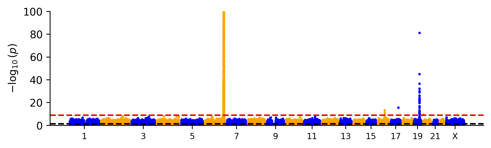

## JHU Biology REU 2026 - Analyzing and visualizing data in genetics

In this lesson, we'll work to reproduce plots that are common in genetics. Figure reproduction using diverse data sets serves as valuable practice with data literacy and familiarity with R. This lesson will also include many code blocks without any explicit code in them -- offering you the opportunity to practice what we've learned throughout this workshop!

We'll work with the following data:

1.  [Genotype data from the 1000 Genomes Project](https://www.internationalgenome.org/)
2.  [Genome-wide association study data from Pan-UK Biobank](https://pan.ukbb.broadinstitute.org/)

------------------------------------------------------------------------

### 1. Genetic diversity in the 1000 Genomes Project

#### 1.1 Allele frequency spectrum (AFS)

We'll begin by working with data from the [1000 Genomes Project](https://www.internationalgenome.org/) (1KGP). The overarching goal of the 1000 Genomes Project is to capture and describe genetic variation across a diverse cohort of human ancestries. We can visualize the global distribution of genetic variants using the [Geography of Genetic Variants browser](https://popgen.uchicago.edu/ggv/?data=%221000genomes%22&chr=1&pos=222087833). Since the project's [first publication in 2010](https://www.nature.com/articles/nature09534), the data set has grown and motivated additional studies that aimed to quantify genetic variance beyond short variants (i.e., single nucleotide polymorphisms and short insertions/deletions). If you want to learn more about the 1KGP data set, here are a few papers:

-   [Sankararaman S. *et al.* 2014. The genomic landscape of Neanderthal ancestry in present-day humans. *Nature* **507**: 354-357](https://www.nature.com/articles/nature12961)

-   [The 1000 Genomes Project Consortium. 2015. A global reference for human genetic variation, *Nature* **526:** 68-74](https://www.nature.com/articles/nature15393)

-   [Taylor et al. 2023. Sources of gene expression variation in a globally diverse human cohort. *Nature.* https://doi.org/10.1038/s41586-024-07708-2](https://www.nature.com/articles/s41586-024-07708-2)

In the first section of this lesson, we'll use a subset of the 1KGP data to look at two common plotting formats for studying genetic variation in human populations: *Allele frequency spectra* and *principle component analysis*.

To begin, let's load and describe the data set:

```{r, results=FALSE, message=FALSE, warning=FALSE}

library(tidyverse)

# Load data
df <- read_csv(file = "data/1KGP_chr21.AFs.csv.gz",
               show_col_types = FALSE)

# Preview data
head(df)
```

The data loaded above captures *allele frequency* (AF) measurements on chromosome 21 at two scales:

1.  Global AF (`AF`)
2.  Continental group AF (`AFR_AF`,`EUR_AF`,`SAS_AF`,`EAS_AF`,`AMR_AF)`

##### 1.1.1 What is allele frequency?

Before we begin plotting, let's describe AF:\
AF is a measurement of the number of *variant* genotypes divided by the total number of genotypes in our sample cohort. Thus, it is a proportion bound between 0 and 1. But what is a *variant* genotype?

When working with genetic sequencing data, we often work with a *reference* - a sample that is used as the baseline with which we make comparisons. In this case, our *reference* is a genome labeled `GRCh38`. To compute VAF in our data set above, each individual's genome (i.e., each *sample* in 1KGP) is compared to the *reference* genome to identify genomic positions (i.e., loci) where that sample's genotype is different from the *reference*. Then, by aggregating the count of *variant* genotypes, we can compute AF both globally (`AF` column) or within continental groups (e.g., `AFR_AF` column).

##### 1.1.2 Plotting AFS

Returning to our data, how can we visualize and explore genetic variation? Let's start by working through the following exercise to plot a histogram of allele frequency. In genetics, we call this kind of histogram an *allele frequency spectrum*.

```{r}

# Using the `AF` variable, plot a histogram using `ggplot` and a `histogram` geom with `binwidth = 0.01`

```

In the plot we generated above, we saw that most variants are observed at very low frequency (0-5%) when we look at the "global" trend in genetic variation. What about the trends *within* each continental group?

```{r}

# First we need to use `pivot_longer()` to transform our dataset for plotting.

df<-df %>% 
  pivot_longer(cols=3:7,
               names_to = "ContGroup",
               values_to = "GroupVAF") %>%
  select(!AF)

# Now that we have our data frame in a format compatible for plotting, let's plot the AFS for each continental group. Here, use `facet_wrap(~ContGroup, nrow=5)` to plot each continental group on its own.

```

From these plots, we can see that the distributions do not look qualitatively different from one another - most variants are very low frequency. Biologically, this pattern is consistent with recent population expansions. We won't dwell on it during this workshop, but you can learn more about how an AFS can provide insight into the [historical evolutionary pressures that shape populations of species in this paper](https://www.nature.com/articles/nrg4005).

------------------------------------------------------------------------

#### 1.2 Principle component analysis (PCA)

##### 1.2.1 What is PCA?

As a reminder, we compute *allele frequency* by first *genotyping* each sample - measuring the alleles in each individual's genome relative to a reference genome (i.e., `GRCh38` in our data set). In addition to using AFS to gain insight into the whole population, we can also compare genotypes to measure relationships between samples. Though there are many ways to investigate relationships between samples (e.g., phylogenetics), we'll apply ***principle component analysis*** (PCA).

PCA can be used to simplify complex data sets by finding "new axes" that capture the most important patterns of variation in the data. The mathematical details of PCA are well-outside the scope of this workshop, but check out [this link to an interactive example of what PCA is and how it works](https://setosa.io/ev/principal-component-analysis/).

##### 1.2.2 Preparing genetic data for PCA

In the example below, we'll use PCA to explore the genetic relationships between 1KGP samples (using common variants on chromosome 21). For this example, we'll use genotype data from a random subset (500 loci) of chromosome 21. This subset will include only *common variants* ($AF ≥ 5\%$), as rare variants have very little "shared information" to help us dissect relationships between samples.

The code below will also revisit many functions and data transformation procedures that we've covered throughout this workshop. This will be the most complex example we've encountered so far, so work slowly and carefully to understand each step.

```{r, results=FALSE, message=FALSE, warning=FALSE}

# Load data

df <- read_csv(file = "data/1KGP_chr21_genotypes.csv.gz",
               show_col_types = FALSE)
df.meta <- read_tsv(file = "data/1KGP_metadata.tsv",
                    show_col_types = FALSE)

# Preview data
head(df)
head(df.meta)
```

Using the data we've loaded above, we want to do the following:

1.  [Prepare]{.underline} `df` for PCA (we'll be using the `prcomp()` ***function*** to perform PCA). `prcomp()` expects a `data frame` or `matrix` ***object*** where rows are samples (e.g., *HG00096*) and columns are variables (e.g. *chr21_7924894*).
2.  [Perform PCA]{.underline} to quantify patterns of variation among our sample genotypes
3.  [Plot]{.underline} these results to visualize PCA results

If we look at the `prcomp` documentation, we can see that the `prcomp` method expects input (`x`) to be, "*a numeric or complex matrix (or data frame)*", where rows are observations and columns are variables. We'll prepare that data below:

```{r}

# Remove columns we don't need (columns 2:7) using `select()`

# Use `as.data.frame()` to convert the tibble to a dataframe

# Set row names to sample IDs using `column_to_rownames()`

# We use the `t()` function to transpose our data frame

```

##### 1.2.3 Running PCA

With our properly formatted data in-hand, we can now perform PCA and prepare the output for plotting.

```{r}

# Run PCA on our data using `prcomp()`

# Preview our PCA output using `glimpse()`

```

We can see from the preview above that there are is quite a lot of information in the PCA output object. For now, we'll focus on the information stored in the `x` slot of the PCA output. This slot contains the "new variables" (i.e., the ***principle components***, or ***PCs***) and each sample's values (loadings) on those new variables.

PCs are ordered by the amount of variation they capture in the data, so $PC1$ captures the most variation, $PC2$ the next greatest, and so on. In practice, we often find that the first few PCs capture most of the variation in the data, so we'll focus on those for plotting.

##### 1.2.4 Prepare PCA results for plotting

We'll begin by extracting only the first two PCs from our PCA output and putting them in a data frame for plotting.

```{r}
# Begin by extracting the PCs and their loadings from the `x` slot of the `prcomp()` output

pca_results <- pca$x

# Create a new dataframe with three columns: sample, PC1, and PC2. 
# The `sample` column will be the row names of our PCA output (i.e., the sample IDs), and the `PC1` and `PC2` columns will be the first two PCs from our PCA output.

pca_df<-data.frame(sample = rownames(df),
                   PC1 = pca_results[,1], # We use the `[]` operator to subset matrices...
                   PC2 = pca_results[,2]) # ...using the same syntax as data frames.

head(pca_df)

```

In the example above, we also used the `$` in a slightly different way than when we've used it to pull columns from a ***data frame***. Broadly, `$` in R is used to access "subsets/slots" of an object, where the "subset/slot" is defined by the object type (for ***data frames***, it's columns). We won't encounter more varieties of the `$` operator in this workshop, but you will likely encounter `$` for other non-***data-frame*** objects in the future if you continue to use `R`.

Now that we have our focal PCA results, we can merge these data with our sample metadata for plotting. The relevance of this step will become apparent when we plot.

```{r}
# Use the `merge()` function to combine our PCA results and metadata

pca_df <- merge(pca_df, df.meta) # By default, `merge` will combine data frames by a shared column name (in this case, "sample")

# Preview the merged dataframe
head(pca_df)
```

##### 1.2.5 Plot PCA results

Using the `pca_df` object, plot the first two PCs and see if any patterns emerge:

```{r}

# Using `ggplot()`, create a scatterplot with PC1 on the x-axis and PC2 on the y-axis.

```

Using this version of the PCA plot, we observe two things:

1.  `PC1` separates one cluster from other clusters along a continuum of samples (points)
2.  `PC2`\$\` separates the "other" clusters along another continuum

By themselves, PCs don't describe any biological or technical feature of the data - they're simply the "axes" that capture the most variation in the data. In order to interpret these axes, we need to annotate our plot with additional information.

We'll begin by adding a categorical variable to our plot - the self-reported `sex` of each sample. Because `sex` is encoded as either $1$ or $2$, we first need to make sure the variable is being treated as a categorical variable. Once we've done that conversion, we can add `sex` to our plot using the `shape` aesthetic:

```{r}

# Convert `sex` to a factor
pca_df <- pca_df %>% 
  mutate(sex = as.factor(sex))

# Using the same plotting backbone as the one used above, add `sex` to the plot using the `shape` aesthetic.


```

In this plot, we see that `sex` is evenly distributed across all clusters when plotted with `PC1` and `PC2` - thus we can conclude that first two PCs are not capturing the variance due to `sex`.

Let's add another categorical variable to our plot - the `congroup` (i.e., "continental group") of each sample. We'll scale the color of each point by `contgroup` using the `color` aesthetic:

```{r}

# Plot again, this time adding `contgroup` to the plot using the `color` aesthetic. 

```

Using the `contgroup` categorical variable, we can now see that `PC1` and `PC2` can sufficiently separate the five "continental groups", though there is still a continuum of relationships along each PC. If you'd like to know more about how human geneticists treat population labels, you can [read more about it here](https://nap.nationalacademies.org/resource/26902/interactive/).

#### 1.3 Summary of 1KGP analyses

To summarize our findings in this section:

-   We examined genetic data from 1KGP to look at patterns of allele sharing on chromosome 22. By plotting ***allele frequency*** as a histogram, we saw that most genetic variants are rare - consistent with an evolutionary history of recent population expansion.

-   We used ***principle component analysis*** to investigate the relationships between samples in 1KGP, showing that the first two *principle components* partially stratify the five "continental groups" (though only explain a fraction of all genetic variance observed). Although we only looked at a single chromosome (the shortest autosome), the trends observed in this section also apply across the whole genome.

------------------------------------------------------------------------

### 2. Genome-wide association studies in the Pan-UK Biobank

#### 2.1 Introduction to GWAS and Pan-UK Biobank

In the section above, we used genotype data from a globally diverse cohort to examine the history of human evolution (and describe modern populations). Here, we'll leverage human genetic diversity to identify genetic loci associated with a trait.

***Genome-wide association studies*** (GWAS) are a type of functional genomic assay that leverages ***linear regression*** to test for associations between a phenotype (e.g., height, resting pulse, or risk of a disease) and a genetic variant. GWAS; but if you'd like to learn more, please take a look at the [2021 *Nature Reviews* article by Uffelmann *et al*.](https://www.nature.com/articles/s43586-021-00056-9).

For this exercise, we'll use data from the [Pan-UK Biobank](https://pan.ukbb.broadinstitute.org/) to generate *Manhattan plots* - a common visualization format for representing the genomic landscape of trait associations. The Pan-UK Biobank is a human genetics data resource that aggregates both genotype and health-related data from \~500,000 individuals across the UK of diverse ancestry. By combining the genotype information and biometric data, the Pan-UK Biobank performed a GWAS for over [7,000 traits (phenotypes)](https://pan.ukbb.broadinstitute.org/phenotypes) and the data is publicly accessible.

#### 2.2 GWAS for *LDL Cholesterol*

We'll begin by working through an example GWAS for *LDL cholesterol,* a blood biochemistry measurement that is associated with increased risk for coronary artery disease. Here, we'll work together to reproduce a pre-generated Manhattan plot before turning to an independent exercise.



Below, we'll outline the critical components of the plot:

1.  *x-axis* is *position* (labeled by chromosome only)
2.  *y-axis* is the association *p-value* (`-log10` transformed for plotting)
3.  *values* are being plotted as points (i.e., it's a scatter plot)
4.  Two horizontal dotted lines associated with two *statistical significance cutoffs* (we'll discuss this more below)

Now that we have our axes defined, let's look at the data:

```{r, results=FALSE, message=FALSE, warning=FALSE}

df <- read_csv(file = "data/PanUKB_LDL_subset.csv.gz",
               show_col_types = FALSE)
head(df)
```

##### 2.2.1 Note on plotting p-values

While the first four columns of our ***data frame*** are directly interpretable (*chromosome, position, reference allele,* and *alternative* allele, respectively), the `neglog10_pval_meta` column corresponds to the $-log_{10}(p\text{-value})$ for the association between the alternative allele and the trait of interest (i.e., *LDL cholesterol*).

To illustrate why we $log_{10}$ transform p-values for plotting, let's simulate some data to show what it looks like to plot raw p-values:

```{r}
# Simulate p-values between 1 and 1e-300
p_df <- data.frame(idx = 0:300,
                   p = 10^(-(0:300)))

head(p_df)

```

The `p_df` data frame above contains p-values ranging from $10^0$ to $10^{-300}$. Below, we'll compare two plots: one with raw p-values plotted on the y-axis, and one with $-log_{10}$-transformed p-values. We'll once again use the `patchwork` library for a multipanel plot.

```{r}
# Load library
library(patchwork)

# Plot raw p-values
g1 <- ggplot(data = p_df,
       mapping = aes(x=idx,y=p)) +
  geom_point() +
  theme_classic() +
  labs(y = expression(p))

# Plot -log10(p-values)
g2 <- ggplot(data = p_df,
       mapping = aes(x=idx,y=-log10(p))) +
  geom_point() +
  theme_classic() +
  labs(y = expression(-log[10](p)))

# Plot 
(g1 | g2)
```

##### 2.2.2 Constructing the Manhattan plot

We'll start by plotting on the x- and y-axes, then introduce other elements. This will be the most complex plot we'll produce during the workshop, so we'll work carefully layer-by-layer:

```{r, results=FALSE, message=FALSE, warning=FALSE}

# Plot `pos` on x-axis, `neglog10_pval_meta` on y-axis, and facet by chromosome (`pos` values can be repeated on each chromosome!). 
# Within `facet_wrap()`, use the `ncol` argument to specify the number of facets to present as columns.

  
```

Using only a few lines of code, we made a lot of progress towards reproducing the example Manhattan plot above. However, there are still a few key elements that are missing in our plot. Let's look at the figure again and identify differences that affect interpretation:


In our plot:

1.  `facets` are out of order
2.  `y-axis` upper-bound is too high
3.  `x-axis` labels are incomprehensible
4.  Dotted lines for p-value significance thresholds are missing

We'll tackle these in order:

```{r, results=FALSE, message=FALSE, warning=FALSE}

# To order our `chr` variable, we will use `mutate()` to convert this column into a `factor`. Using `factors` we can specify the order that chromosome values should appear in.

df$chr %>% 
  unique() # Allows us to print the values that occupy the `chr` column

chrs <- c(1:22, "X") # Create a vector listing 1 to 22, then followed by "X"

df <- df %>%
  mutate(chr = factor( x = df$chr, levels = chrs)) # Use the `factor()` function to order the "levels" of df$chr according to our `chrs` vector

# Now that we've re-factored our `chrs` variable, plot using the same plotting command we constructed above:


```

Using `factor()`, we changed our `chr` variable from unorganized *`character`* variable, to an ordered *`factor`* variable. This is a very common procedure when plotting categorical variables where order matters (e.g., months of the year).

Next, we'll address the *y-axis* bounds and the *x-axis* labels:

```{r, results=FALSE, message=FALSE, warning=FALSE}

# Adjust the y-axis bounds with `scale_y_continuous()`


```

```{r}
# Remove the noisy x-axis text with `theme()`

```

```{r}
# Make a few more clarity changes: 
# 1. Remove x-axis features (`theme()`)
# 2. Add axis labels (`labs()`)
# 3. Move facet labels to the bottom (`strip.position = "bottom"` in `facet_wrap`)

```

Now that we've organized the axes and made a few style adjustments, we can add the last major plotting feature: significance threshold lines. In the example plot, there are two dotted lines:

1.  Black dashed line: Nominal significance threshold ($p < 0.05$)
2.  Red dashed line: Genome-wide significance threshold ($p < 5 \times 10^{-8}$)


We can add these two lines (after applying a `-log10` transform so they can be plotted on the same scale as our p-values) using `geom_hline()`:

```{r, results=FALSE, message=FALSE, warning=FALSE}

# Add `geom_hline` on top of the scatter plot layer


```

With that addition, the Manhattan plot we've assembled is quantitatively the same as the example we were trying to recreate!

However, we can still improve the visual components of the plot to facilitate interpretability:

1.  The points are large and overlapping (this is a phenomenon called *overplotting*)
2.  We have large gaps between chromosome columns
3.  Using colors, we can better distinguish observations between adjacent chromosomes.

To address points 1 and 2, we'll pivot from `facet_wrap()` to `facet_grid()` which provides more control to spacing when we have prior knowledge on the number of facets.

```{r, results=FALSE, message=FALSE, warning=FALSE}

# Replace the `facet_wrap` layer with the following `facet_grid` command:
facet_grid(cols = vars(chr), # Create a column facet for each chr
           switch = "x", # Place facet label on bottom
           space = "free_x", # Allow facets to be different widths
           scales = "free_x") # Allow chrs to have different bounds

```

Finally, we'll add color to each point in our plot (dependent upon chromosome) using `scale_color_manual()`. To achieve this, we'll add an *aesthetic* for the `chr` variable, and set the values for each `chr` using the `values` argument of `scale_color_manual()`

```{r}

# Create a vector of color strings of length equal to the number of levels in df$chr
# Try running the following command, element by element, in the console below to figure out what it does
cols <- c(rep(x = c("blue","orange"), times = 11),
          "blue") 

# Add `chr` as a color aesthetic, and add the following `scale_color_manual` command to your plot

... +
  scale_color_manual(values = cols)

```

We've now faithfully reproduced the plot showing the same result! While we could make some further modifications, this example serves as a scaffold for which ***Manhattan plots*** can be built from the ground up.

Biologically, we observe the strongest signal for high *LDL Cholesterol* at the end of chromosome 6. This GWAS peak is in the gene *LPA* which is fundamental to plasma lipoprotein assembly.

------------------------------------------------------------------------

#### 2.3 Manhattan plotting exercise

As a final exercise to this lesson (and the workshop as a whole), we will use the blood glucose GWAS result from the Pan-UK Biobank:

```{r, results=FALSE, message=FALSE, warning=FALSE}

df <- read_csv(file="PanUKB_Glu_subset.csv.gz")
head(df)
```

With these data, practice data preparation and plotting by performing the following tasks:

```{r, results=FALSE, message=FALSE, warning=FALSE}
#   1. Remove the `bonfp` column using `select()` from `dplyr`

```

```{r, results=FALSE, message=FALSE, warning=FALSE}
#   2. Filter the data frame to only chromosomes 1 through 5 (you can use the following expression `chr %in% c(1:5)` with `filter()` to test whether `chr` is any value in 1:5)

```

```{r, results=FALSE, message=FALSE, warning=FALSE}
#   3. Create a Manhattan plot for your filtered data frame where:
#     a. The `color` aes is scaled by chromosome
#     b. Include horizontal lines for significance cutoff(s)
#     c. Readily interpretable (e.g., fix axis labels & aesthetic changes)

```

```{r, results=FALSE, message=FALSE, warning=FALSE}
#   4. Filter the data frame to include only the chromosome with the highest p-value

```

```{r, results=FALSE, message=FALSE, warning=FALSE}
#   5. Plot the Manhattan plot for only this chromosome

```

```{r, results=FALSE, message=FALSE, warning=FALSE}
#   6. Using a similar method as `scale_y_continuous(limits = c(0, 100))` that we used in the example above, use `scale_x_continuous(limits = ...)` to zoom into the strongest hit on the chromosome (this may take several attempts)

```

Unlike the LDL GWAS, there are many significant hits for loci that influence blood glucose biochemistry. Although GWAS is a powerful tool to identify genetic associations with a trait, these analyses often open more questions than they answer - ones that require further scientific rigor to understand the mechanisms underlying the association.

------------------------------------------------------------------------

### 3. Closing remarks

*And that's the JHU Biology REU data science workshop!*

We've covered quite a lot in four days, so lets review what we've covered:

-   **Day 1**: Introduction to R as a programming language
-   **Day 2**: R as a platform for data science
-   **Day 3**: Probability and statistics in R
-   **Day 4**: Using R to reproduce biological results

R is a powerful and flexible tool for data science. As you continue forward in research (both within your REU and perhaps beyond it), you will likely encounter many more opportunities to use R (or other programming languages) to ask and answer scientific questions.

As a reminder, the following resources are available freely online should you want to continue practicing:

-   [Hands-On Programming with R](https://rstudio-education.github.io/hopr/)
-   [R for Data Science (2e)](https://r4ds.hadley.nz/)
-   [Learning Statistics in R](https://learningstatisticswithr.com/)
-   [An Introduction to Statistical Learning](https://www.statlearning.com/)
