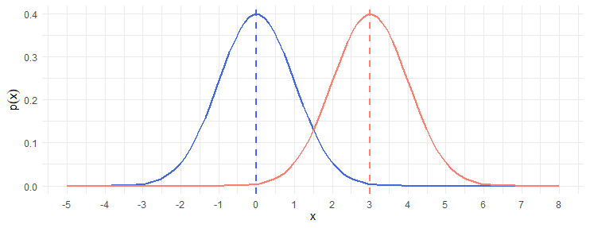
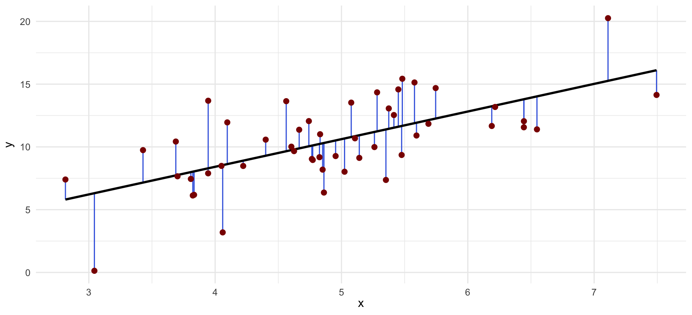

```{r setup, include = FALSE}
knitr::opts_chunk$set(comment = "",
                      fig.align = 'center',
                      out.width = "75%")
```

Today's lesson will focus on some basic concepts in ***probability*** and ***statistics***, which are essential for analyzing biological data and reaching reproducible conclusions. We will focus specifically on how to implement these concepts/techniques in R.

***Statistics*** are a fundamental component of science, providing a quantitative framework for analyzing data, testing hypotheses, and drawing robust conclusions. In biology, we often work with quite messy data, and ***statistics*** help us distinguish *signal* from *noise*, identify patterns, and make informed conclusions based on our data.

We will cover the following topics:

-   Normal probability distribution

-   Hypothesis testing (*t*-test)

-   Linear regression

We will only cover the basics here, focusing on flexible methods that are applicable across biological disciplines. For more in-depth knowledge on these subjects, I recommend reading [*Introduction to Statistical Learning*](https://www.statlearning.com/) by Gareth James, Daniela Witten, Trevor Hastie, and Robert Tibshirani.

------------------------------------------------------------------------

## 1. The normal distribution

There are many ***probability*** ***distributions*** that can be used to model different types of data. One of the most common distributions used in biology is the ***normal distribution***, which is often used to model ***continuous*** data that are expected to be symmetrically distributed around a mean. The ***normal distribution*** is the classic "bell curve". For example, a common null hypothesis in biology is that morphometric traits (e.g., height or weight) are normally distributed.


The plot above reflects the ***probability*** (y-axis) of random observations (x-axis) generated using a ***normal distribution***. This is similar to ***histograms*** we saw in the previous lesson, but instead of "count" on the y-axis, we plot ***probability***. In the plot above, the probability of observing $x = 0$ is approximately $0.4$ (also written as $p(x = 0) \approx 0.4$).

Thus, we can ask rather intuite questions like, "What is the ***probability*** of observing an $x$ value $\ge 1.0$?" To give this biological relevance, if we have a trait that is normally distributed (e.g., height), we can ask, "What is the ***probability*** of observing an individual with a height $\ge 6ft$?"

Note that there are many probability distributions beyond the ***normal distribution***. If you'd like to know more, take a look at [this website](https://www.acsu.buffalo.edu/~adamcunn/probability/probability.html) hosted by Adam Cunningham at the University of Buffalo. Below, we'll focus on the ***normal distribution.***

### 1.1 The normal distribution parameters

The ***normal distribution*** is defined by two parameters:

-   The ***mean*** ($\mu$), which represents the *average* value of the distribution.

-   The ***variance*** ($\sigma^2$), which represents the *spread* of the distribution around the mean.

Shorthand, you may see the normal distribution represented as $N(\mu, \sigma^2)$.

In R, we can use the `rnorm()` function to generate random values a ***normal distribution***. As before, you can use `?rnorm` to learn more about this function. Below, we'll generate $1000$ random values from $N(\mu = 0, \sigma^2 = 1)$ and plot the ***distribution*** as a ***histogram***:

```{r, warning = FALSE, message = FALSE}

# Load necessary libraries
library(tidyverse)

# Set seed for reproducibility
set.seed(123)

# Generate 1000 random values from a normal distribution
dat <- rnorm(n = 1000,
             mean = 0,
             sd = 1)

# Preview dat
head(dat)
```

```{r}

# Plot our data
tibble(dat) %>%
  ggplot(mapping = aes(x = dat)) +
  geom_histogram(bins = 100) +
  theme_minimal() +
  labs(x = "value")

```

Qualitatively, this ***distribution*** *looks* normal, and while there are formal test for normality (e.g., Shapiro-Wilk test), visual inspection will suffice here. Try playing with the value of `n` in the `rnorm()` function above – what happens when `n` is very small or very big?

But how do we use the ***normal distribution*** to study our data? To address this question, let's return to the `iris` data set.

### 1.2 Calculating probability from the normal distribution

Imagine that we have an incomplete record of $x = 4.0 cm$ associated with the `Petal.Length` variable, but no information on which of the species it belonged to. Our goal is to infer the species identity of this sample from our incomplete record.

To accomplish our goal, we will assume `Petal.Length` is ***normally distributed*** for each species. With this assumption, we can quantify the ***probability*** that $x = 4.0\text{cm}$ (i.e., $p(x = 4.0)$) for each species and assign identity based on the resulting ***probabilities***.

Below, we'll use the `dnorm()` function to compute the probability of observing $x = 4.0\text{cm}$ for each species. `dnorm()` has three parameters that we'll need to specify for each species:

-   `x`: Our incomplete record's value of `Petal.Length` (i.e., $x = 4.0\text{cm}$)

-   `mean`: The mean `Petal.Length` for each species

-   `sd`: The standard deviation of `Petal.Length` for each species

First, we'll load our data.

```{r}

# Load the iris data set and set our value of x
df <- iris
unknown_x <- 4.0

```

Next, we need to calculate the mean ($\mu$) and standard deviation ($\sigma$) of `Petal.Length` for each species using the `tidyverse` functions we learned in the previous lesson.

```{r}

prob.df <- df %>%
  summarise(mean = mean(Petal.Length),
            sd = sd(Petal.Length),
            .by = Species)

head(prob.df)

```

The command above computes the mean and standard deviation of `Petal.Length` for each species using the `summarise()` function with the `.by` argument grouping by `Species`. You can see from the output above, the `prob.df` object now contains only a single entry for each species – each one summarizing the ***mean*** and ***standard deviation*** of `Petal.Length`.

Finally, we'll compute $p(x=4.0)$, where $x$ is `Petal.Length`, for each species using the `mutate()` function below (we'll also use `round()` within the `mutate()` function to do some formatting of our results for ease of interpretation):

```{r}

prob.df <- prob.df %>%
  mutate(prob = dnorm(x = unknown_x, 
                      mean = mean, 
                      sd = sd) %>%
           round(digits = 3))

prob.df

```

Given our calculations above, we observe the greatest probability estimate is associated with the *Iris versicolor* species ($p = 0.728$). This specific approach leverages the statistical concept of ***likelihood***, the ***probability*** of observing our data ($x = 4.0$) given some set of ***parameters*** (i.e., `Species` is either *setosa*, *versicolor,* or *virginica*).

***Likelihood*** and ***probability*** are deeply interconnected subjects, but their distinctions and use-cases are beyond the contexts of this workshop.

### 1.3 Practice with the normal distribution

To practice the techniques we've described above, we'll simulate body weight measurements for [domestic cats](https://avmajournals.avma.org/view/journals/javma/255/2/javma.255.2.205.xml). Using these data, we'll address the question, "What is the probability of observing a $x > 6\text{kg}$ cat?"

1.  Simulate $1000$ cat weights with a ***mean*** of $4.93\text{kg}$ and a ***standard deviation*** of $1.4\text{kg}$.

```{r}

# set seed for reproducibility
set.seed(150) 

x <- rnorm(n = 1000,
           mean = 4.93,
           sd = 1.4)

```

2.  Plot the distribution of simulated cat weights as a histogram, add a vertical line at $x = 6.0$ (using `geom_vline()`). Remember, you can run `?geom_vline()` learn more about its arguments.

```{r}

ggplot(data = tibble(x),
       mapping = aes(x = x)) +
  geom_histogram(bins = 50) +
  geom_vline(xintercept = 6,
             color  = "blue") +
  theme_minimal()

```

3.  Calculate the ***probability*** of observing a cat that weighs $> 6.0\text{kg}$. For this question, you'll need to use `pnorm()`. By default, `pnorm()` computes the ***cumulative probability*** (i.e., the area under the curve of a ***normal distribution***) for all values $\le x$, you'll have to figure out how to compute $p(x > 6\text{kg})$ from the default `pnorm()` output. *NOTE: You do not need to use the data generated above to complete this task.*

```{r}

1 - pnorm(q = 6,
          mean = 4.93,
          sd = 1.4)

```

---

## 2. Hypothesis testing

***Hypotheses*** are statements that describe a phenomenon/observation, and a good hypothesis should be testable, falsifiable, and specific.

For example:

-   "*The genetic variant at locus X is associated with an increased risk of skin cancer.*"

-   "*The mean body weight of cats is less than 10kg.*"

-   "*The leaves of plant species A are longer than plan species B.*"

Developing a simple and elegant ***hypothesis*** takes practice and is a critical step to the scientific process. Whether it's during experimental design or writing grant proposals, you'll encounter ***hypothesis*** development frequently.

There are many different statistics that can be used for hypothesis testing, and plenty of guidance on which tests are appropriate for the questions you're trying to answer (see [this article](https://statsandr.com/blog/what-statistical-test-should-i-do/) by Antoine Soetewey for an overview). Here, we'll focus on one of the most common tests: the ***t*****-test**.

### 2.1 Performing a t-test

The ***t*****-test** is a statistical test that can be used to test the ***hypothesis*** that the difference in means between the two groups is $0$. Using the figure below as a visual example, we can use a ***t*****-test** to ***quantitatively*** estimate whether the ***means*** of the blue and red ***distributions*** are the same.



#### 2.1.1 The Palmer Penguins data set.

To get an intuition for what a *t*-test specifically tests, let's simulate some data using a new biological dataset: `palmerpenguins`. Run `install.packages("palmerpenguins")` in the console below to download and install the data set. After that, run the following code block to preview the data.

```{r, message = FALSE}

# Load library
library(palmerpenguins)

# Create copy of the data set
df <- penguins
head(df)

```

To learn more about the `penguins` data set, run `?penguins` to open the documentation.

Next, let's subset our data and plot the ***distributions*** of body mass (`body_mass_g`) for two `species` of penguin: *Adelie* and *Gentoo*. Note the use of the `%in%` operator in the `filter()` function below. This operator allows us to filter for multiple values in a single column – specifically testing whether the value of `species` is contained in the vector `c("Adelie", "Gentoo")`.

If the string of commands below is hard to follow, try removing ***functions*** (beginning at the end of the command) and seeing how it affects the resulting `g` object.

```{r}

# Create plot
g <- df %>% 
  filter(species %in% c("Adelie", "Gentoo"),
         !is.na(body_mass_g)) %>%
  ggplot(mapping = aes(x = body_mass_g, 
                       fill = species)) +
  geom_histogram(binwidth = 100, 
                 alpha = 0.5, 
                 position = "identity") +
  theme_minimal() +
  labs(x = "body mass (g)",
       y = "number of penguins",
       fill = "species")

# Print plot
g

```

From the plot above, we ***qualitatively*** observe that these two penguin species likely possess two distinct mass distributions, with *Gentoo* penguins being heavier than *Adelie* penguins. But how can we ***quantitatively*** test this ***hypothesis***? This is where the ***t*****-test** comes in!

#### 2.1.2 Student's *t*-test for body mass.

The ***t*****-test** allows us to test the ***null hypothesis*** that the two groups possess [equal means]{.underline}. Thus, the ***alternative hypothesis*** is that the two groups possess [unequal means]{.underline}. While we won't go into the details of the ***t*****-test** formula or assumptions here, you can learn more about them in Danielle Navarro's [`Learning Statistics in R`](https://learningstatisticswithr.com/).

To perform a ***t*****-test** in R, we can use the `t.test()` function. We'll set the flag `var.equal = FALSE` to perform a Welch's ***t*****-test**, which [does not]{.underline} assume equal variances between the two groups.

First, we'll extract `body_mass_g` values for each `species`. The `pull()` ***function*** from `tidyverse` will *pull* all values from a column and return them as a vector.

```{r}

# Create vectors of body mass adelie penguins
adelie <- df %>%
  filter(species == "Adelie") %>%
  pull(body_mass_g)

# Preview adelie
head(adelie)

```

```{r}

# Create vectors of body mass adelie penguins
gentoo <- df %>%
  filter(species == "Gentoo") %>%
  pull(body_mass_g)

# Preview gentoo
head(gentoo)

```

```{r}

# Perform t-test
t.test(x = adelie, 
       y = gentoo, 
       var.equal = FALSE)

```

The `t.test()` ***function*** outputs several important values; we'll focus on the ***p*****-value** first. A ***p*****-value** which is *the **probability** of observing the test statistic (or more extreme) assuming the **null hypothesis** is true*. In this case, it is the ***probability*** of observing the difference in ***mean*** body mass between *Adelie* and *Gentoo* penguins (or a more extreme difference) assuming that the true ***mean*** body mass of these two species is equal.

The ***p*****-value** from our ***t***-**test** isvery small ($p < 0.001$), which provides evidence that our ***null hypothesis*** of equal means is unlikely to be true. Thus, [we reject the null hypothesis]{.underline}.

The ***p*****-value** is an important (and controversial) subject in ***statistics*** and ***hypothesis testing*** – we won't dwell on the specifics of how a ***p*****-value** is calculated here, but I again encourage you to check out Danielle Navarro's [`Learning Statistics in R`](#0) for a more detailed summary.

### 2.2 Practice with t-test

Below, we'll test whether *Adelie* penguins from *Biscoe Island* possess the same ***mean*** body mass as *Adelie* penguins on *Dream island*. As a reminder, here are some important ***functions*** (use `?<function>` to open documentation):

-   `t.test()`: performs a ***t-test***
-   `ggplot(data = ..., mapping = aes(...))`: creates a `ggplot` object
    -   `geom_histogram(alpha = ..., position = "identity")`: creates a ***histogram*** layer
    -   `geom_vline(xintercept = ...)`: adds a vertical line to a plot at the specified x-intercept

```{r}

# Create a new copy of penguins
df <- penguins

```

1.  Create two ***vectors*** of body mass:

-   *Adelie* penguins sampled on Biscoe Island
-   *Adelie* penguins sampled on Dream Island

```{r}

# Extract Biscoe Adelie body mass
biscoe <- df %>%
  filter(species == "Adelie",
         island == "Biscoe") %>%
  pull(body_mass_g)

# Extract Dream Adelie body mass
dream <- df %>%
  filter(species == "Adelie",
         island == "Dream") %>%
  pull(body_mass_g)

```

2.  Perform a two-sample Welch's ***t*****-test** to compare the ***mean*** body mass of these two groups

```{r}

t.test(x = biscoe,
       y = dream,
       var.equal = FALSE)

```

3.  Plot the ***distributions*** of body mass for these two groups as a ***histogram*** and add vertical lines at the ***mean*** body mass for each group. *Hint: You can use two separate `geom_vline()` layers to add vertical lines for each group once you know the means.*

```{r}

# Extract mean for each island:
biscoe_mean <- mean(biscoe, 
                    na.rm = TRUE)

dream_mean <- mean(dream, 
                   na.rm = TRUE)

# Subset data, then plot
df %>%
  filter(species == "Adelie",
         island %in% c("Biscoe","Dream")) %>% 
  ggplot(mapping = aes(x = body_mass_g, 
                       fill = island)) +
  geom_histogram(bins = 20,
                 alpha = 0.5,
                 position = "identity") +
  geom_vline(xintercept = biscoe_mean,
             color = "red") +
  geom_vline(xintercept = dream_mean,
             color = "blue") +
  theme_minimal()

```

---

## 3. Linear regression

***Linear regression*** is a very powerful and flexible statistical tool for both ***inference*** (e.g., *What is the relationship between* $x$ and $y$?) and ***prediction*** (e.g., *How accurately can I predict* $y$ given some new value of $x$?).

Here are some examples of studies that leverage ***linear regression*** to study human genetics:

-   Testing for associations between genetic variants and complex traits (i.e., *genome-wide association studies*, or *GWAS*). See [Konrad et al. 2025](https://www.nature.com/articles/s41588-025-02335-7).
-   Identifying genetic loci that affect a gene's expression (i.e., identifying *expression quantitative-trait loci*, or *eQTLs*). See [GTEx Consortium 2020](https://www.science.org/doi/10.1126/science.aaz1776).
-   Predicting an individual's polygenic risk for disease (i.e., *polygenic risk score*, or *PRS*). See [Lennon et al. 2024](https://www.nature.com/articles/s41591-024-02796-z).

In the most simple terms, ***linear regression*** uses a statistical technique called *least squares* to fit a straight line to a set of data points. The line is fit to the data such that it minimizes the *sum of squared error* – the distance between the *predicted* value of $\hat{y}$ and the *observed* value of $y$.

In the plot below, the *residual error* is represented as vertical blue lines connecting each *observed* $y$ (red points) to its predicted $\hat{y}$ at each value of $x$.



This strategy simultaneously allows us to test for ***correlation*** between our $x$ and $y$ variables, while also empowering ***prediction***. There are **many** extensions of ***linear regression***. I highly recommend [Introduction to Statistical Learning](https://www.statlearning.com/) as a pragmatic and approachable introduction to these topics.

Here, we'll focus on simple ***linear regression*** where there is one ***predictor variable*** ($x$) and one ***response variable*** ($y$).

### 3.1 Linear regression on simulated data

#### 3.1.1 Simulating data.

To provide an intuition of how ***linear regression*** works in R, we'll be begin by simulating two data sets:

-   A strong linear relationship between $X$ and $Y$

-   No relationship between $X$ and $Y$.

```{r}

# Set random seed
set.seed(500)

# Simulate x and y with a known dependency of y on x
x <- rnorm(n = 100, mean = 50, sd = 5)
y <- 50 + (2*x) - rnorm(n = 100, mean = 0, sd = 10)

df.strong <- data.frame(x = x,
                        y = y)

# Preview df.strong
head(df.strong)

```

```{r}

# Set random seed
set.seed(500)

# Simulate x and y without any dependency
x <- rnorm(n = 100, mean = 50, sd = 5)
y <- rnorm(n = 100, mean = 10, sd = 10)

df.null <- data.frame(x = x,
                      y = y)

# Preview df.null
head(df.null)

```

The `df.strong` data uses a ***linear model*** with the form $y = 50 + 2x + \epsilon$, where the error term $\epsilon$ is defined by `rnorm()` to introduce some ***noise*** into the data (perhaps due to inaccuracies built into our hypothetical device used to measure $y$). In contrast, `df.null` simulates each value of $y$ completely independent of $X$.

#### 3.1.2 Plotting simulated data.

Now that we've simulated some data, let's plot these data to visualize any trends prior to performing ***linear regression***. We will also use a new library to plot multiple panels simultaneously: `patchwork`. To download and install this package, run `install.packages('patchwork')` in the console below.

```{r, message = FALSE}

# Load patchwork
library(patchwork)

# Generate the plots
g.strong <- df.strong %>%
  ggplot(mapping = aes(x = x,
                       y = y)) +
  geom_point() +
  theme_minimal() +
  labs(x = "x",
       y = "y",
       title = "Strong linear relationship")

g.null <- df.null %>%
  ggplot(mapping = aes(x = x,
                       y = y)) +
  geom_point() +
  theme_minimal() +
  labs(x = "x",
       y = "y",
       title = "No linear relationship")

```

With our plots generated and stored in `g.strong` and `g.null`, we can now use the `patchwork` syntax to plot these two panels side-by-side.

```{r}

# Plot the two panels side-by-side
(g.strong | g.null)

```

In the plot panels above, we can make some ***qualitative*** conclusions about the relationships between $X$ and $Y$. While these plots can provide an intuition about these relationships, we can use ***linear regression*** to ***quantify*** the relationship between $X$ and $Y$ for each data set.

While we [know]{.underline} the relationships between the ***predictor*** and ***response*** variables here, *you will not know the true relationship between your **predictor(s)** and the **response** variable when you're performing your own experiments!*

#### 3.1.3 Performing linear regression.

Now that we have an intuition for the trends in our data sets, let's perform ***linear regression*** to ***quantify*** the relationship between $x$ and $y$ using the `lm()` ***function***. Take a look a the function's documentation for more details. Here, we'll use only two of the ***arguments***:

-   `formula`: a string in the format of `response ~ predictor` for model fitting
-   `data`: a ***data frame*** containing the ***response*** and ***predictor*** variable specified in `formula`

The output from `lm()` is not immediately informative, so we'll also pipe (`%>%`) the output from `lm()` to `summary()` for a more intepretable output from our linear regression. Below, we'll begin by using `lm()` with the `df.strong` ***data frame***.

```{r}

lm(data = df.strong,
   formula = y ~ x) %>%
  summary()

```

The output from `summary()` contains a lot of information about our model fit, but we'll focus on the `Coefficients` slot of the output:

-   `Estimate`: This field describes the estimated relationship between the predictor(s) and the response variable. As the ***linear model*** has the general form of $y = mx + b$, there are two ***coefficients*** estimated in our regression.

    -   `(Intercept)` is value of $y$ when $x = 0$. In our ***linear model*** formula, the *intercept* is the $b$ term. The estimated value of $51.2971$ is pretty close to our encoded intercept of `50`, but differs due to the random noise introduced by `rnorm()`

    -   `x` is the unit increase in $y$ per unit increase in $x$ (i.e., our *slope* or $m$ term in the ***linear model***). Here, `lm()` inferred a coefficient of $x = 1.9927$ which is awfully close to the predefined slope of `2` – differing once again due to noise introduced by `rnorm()`.

-   `Pr(>|t|)` : These are the ***p*****-values** associated with each ***coefficient***. In simple ***linear regression***, **coefficient *p*-values** are calculated using a one-sample ***t*****-test** that tests the ***hypothesis*** that the ***coefficient*** estimate is equal to $0$ (i.e., *slope* $= 0$).

We can describe the results above as the following: "For every unit increase in $x$, there is an estimated increase of $1.9927$ units in $y$ (*p*-value \< 0.001)."

Let's repeat the ***regression*** for our second data set:

```{r}

# Perform linear regression on the "null" simulated data
lm(data = df.null,
   formula = y ~ x) %>%
  summary()

```

In contrast to the `df.strong` data set, we do not observe an appreciable relationship between $x$ and $y$ in `df.null`. Specifically, the $x$ **coefficient's *p*-value** is not significantly different from $0$ (***p*****-value** = 0.946). The $R^2$ value of our model is also $\approx 0$. $R^2$ measures the proportion of variance of the ***response variable*** that is explained by the ***predictor(s)***. An $R^2 \approx 0$ suggests the model doesn't explain any of the variation in $y$. This is to be expected for `df.null`, as both $x$ and $y$ were both independently drawn from a normal distribution.

Now that we've inferred the relationship between $X$ and $Y$ for each data set, let's add our ***regression*** lines to our plots to [visually]{.underline} communicate our findings!

#### 3.1.4 Plotting trend lines.

In the previous lesson on `tidyverse`, we introduced a technique for adding a trend line in `ggplot`. Below, we'll reintroduce this plotting technique and then move on to some practice. We'll udpate the `g.strong` and `g.null` plotting objects from earlier.

```{r}

# Update our plots with trend lines
g.strong <- g.strong +
  geom_smooth(method = "lm", 
              formula = y ~ x,
              color = "black") 

g.null <- g.null +
  geom_smooth(method = "lm", 
              formula = y ~ x,
              color = "black")

# Plot the two panels side-by-side usign the `patchwork` syntax
(g.strong | g.null)

```

The plots above visually recapitulate the results produced by `lm()`. In the left panel, there's a strong non-zero slope that corresponds to the ***coefficient*** estimate of $1.9927$. In the right panel, the slope of the best-fit line is not appreciably different than $0$; indeed, our regression estimate for this line's slope is $\approx 0.007$.

### 3.2 Practice with linear regression on real data.

We'll apply ***linear regression*** to the estimate the effect of *sex* on *body mass* in the `penguins` data set. Note that *sex* is a ***categorical predictor variable***, it takes two non-numeric values: *male* and *female*. Performing ***linear regression*** between a ***categorical predictor*** and a ***continuous response variable*** is also known as ***ANOVA***. If you want to know more about how ***linear regression*** works with ***categorical predictors***, take a look at *Chapter 14* in [*Learning Statistics in R*](https://learningstatisticswithr.com/)*.*

Here, the coefficient for *sex* represents the additional *body mass* in *male* penguins, relative to *female* penguins. *Female* is the reference level for *sex*, as it alphabetically precedes *male*. The reference level for a ***categorical variable*** can be specified manually, but we'll leave it as is.

Some important functions that you'll need in this section:

-   `lm()`: performs ***linear regression***
-   `summary()`: summarizes the output of `lm()`
-   `ggplot()`: creates a `ggplot` ***object***
    -   `geom_point()`: create a scatter plot layer (useful for ***continuous predictors***)
    -   `geom_boxplot()`: create a box plot layer (useful for ***categorical predictors***)
    -   `geom_violin()`: create a violin plot layer (useful for ***categorical predictors***)
    -   `geom_smooth(method = "lm", formula = y ~ x)`: add a ***regression***/trend line to a plot

```{r}

# Load data for this section
df <- penguins

```

1.  Remove any observations where either *body mass* or *sex* are `NA`

```{r}

df <- df %>%
  filter(!is.na(body_mass_g),
         !is.na(sex))

```

2.  Use ***linear regression*** to estimate the effect of *sex* on *body mass.*

```{r}

lm(data = df,
   formula = body_mass_g ~ sex) %>%
  summary()

```

3.  Plot the relationship between *sex* and *body mass*, include a ***regression line*** between *sex* values. Using the following argument in `geom_smooth()` to make the ***regression line*** reflect the difference between groups: `mapping = aes(group = 1)`.

```{r}

ggplot(df,
       mapping = aes(x = sex, y = body_mass_g)) +
  geom_boxplot() +
  geom_smooth(method = "lm",
              formula = y ~ x,
              mapping = aes(group = 1)) +
  theme_minimal()

```

4.  Summarize your ***regression*** results in one or two sentences.

```         

Male penguins weigh an averge of 683.41g more than female penguins (p < 2e-16).
```

For additional practice with regression, try adding additional predictors in your model (e.g., `species`)!

------------------------------------------------------------------------

**Congratulations!** We've covered some fundamental techniques in ***probability*** and ***statistics*** that you'll almost certainly encounter again throughout a career in science! While we only scratched the surface, the concepts we've covered in today's lesson help build a foundation for many strategies we use to study the natural world.

In the next (and final) lesson of this workshop, we'll step directly into the field of ***human genetics***.

------------------------------------------------------------------------

## 4. Recommended reading

There are many more techniques that can be exploited for analyzing data and discovering trends/associations. Whether you're already acquainted with ***statistics*** or just now beginning to learn, I highly recommend the following resources:

-   [An Introduction to Statistical Learning](https://www.statlearning.com/) by Gareth James, Daniela Witten, Trevor Hastie and Robert Tibshirani.

-   [Learning Statistics in R](https://learningstatisticswithr.com/) by Danielle Navarro.
