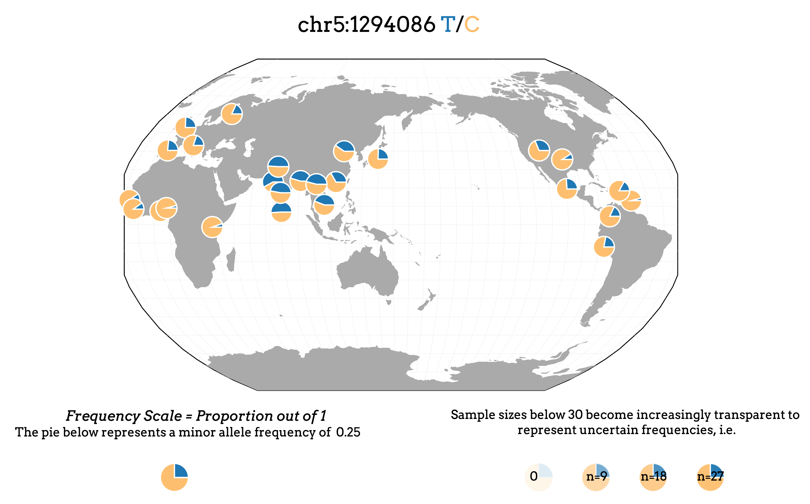
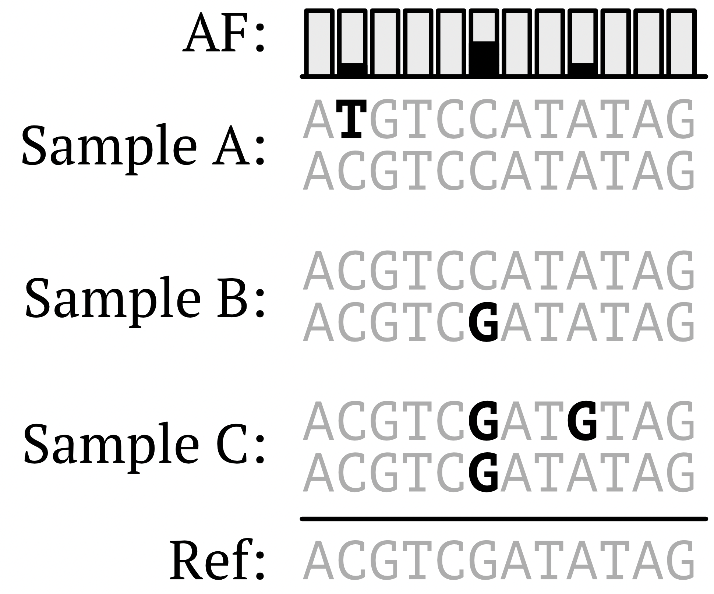

```{r setup, include = FALSE}
knitr::opts_chunk$set(comment = "",
                      fig.align = 'center',
                      out.width = "75%",
                      dev = "jpeg")
```

In this lesson, we'll work to reproduce plots that are common in ***genetics***. Figure reproduction using diverse data sets serves as valuable practice with data literacy and familiarity with R. This lesson will also include many code blocks without any explicit code in them – offering you the opportunity to practice what we've learned throughout this workshop!

We'll work with the following data:

1.  [Genotype data from the 1000 Genomes Project](https://www.internationalgenome.org/)
2.  [Genome-wide association study data from Pan-UK Biobank](https://pan.ukbb.broadinstitute.org/)

------------------------------------------------------------------------

## 1. Genetic diversity in the 1000 Genomes Project

### 1.1 Allele frequency spectrum (AFS)

We'll begin by working with data from the [1000 Genomes Project](https://www.internationalgenome.org/) (1KGP). A major motivation of the 1KGP is to capture and describe genetic variation across a diverse cohort of human ancestries. We can visualize the global distribution of genetic variants using the [Geography of Genetic Variants browser](https://popgen.uchicago.edu/ggv/?data=%221000genomes%22&chr=1&pos=222087833) (screenshot below).



Since the project's [first publication in 2010](https://www.nature.com/articles/nature09534), the data set has grown and motivated many additional studies. If you want to learn more about the 1KGP data set, here are a few papers:

-   [Sankararaman S. *et al.* 2014. The genomic landscape of Neanderthal ancestry in present-day humans. *Nature* **507**: 354-357](https://www.nature.com/articles/nature12961)

-   [The 1000 Genomes Project Consortium. 2015. A global reference for human genetic variation, *Nature* **526:** 68-74](https://www.nature.com/articles/nature15393)

-   [Taylor et al. 2023. Sources of gene expression variation in a globally diverse human cohort. *Nature.* https://doi.org/10.1038/s41586-024-07708-2](https://www.nature.com/articles/s41586-024-07708-2)

In the first section of this lesson, we'll use a subset of the 1KGP data to look at two common plotting formats for explore ***genetic variation*** in human populations: *Allele frequency spectra* and *principle component analysis*.

To begin, let's load and describe the data set:

```{r, warning = FALSE}

library(tidyverse)

# Load data
df <- read_csv(file = "../data/1KGP_chr21.AFs.csv.gz",
               show_col_types = FALSE)

# Preview data
head(df)
```

The data loaded above captures ***allele frequency*** (AF) measurements on chromosome 21 at two scales:

1.  Global ***allele frequency*** (`AF`)
2.  Continental group ***allele frequency*** (`AFR_AF`, `EUR_AF`, `SAS_AF`, `EAS_AF`, `AMR_AF`)

#### 1.1.1 What is allele frequency?

***Allele frequency*** is a measurement of the number of ***variant*** ***genotypes*** divided by the total number of genotypes measured our sample cohort. For example, if we observe $2$ ***variant genotypes*** in $100$, this would yield $\text{AF} = 0.02$. Thus, ***allele frequency*** is a proportion bound between $0$ and $1$.

But how do we define ***variant genotypes?*** We'll use the figure below to describe this concept.



When working with ***genetic sequencing*** data, we often describe genetic variation relative to a *reference*. In the figure above, the *reference* is displayed as a single string: `ACGTCGATATAG` – a ***genetic sequence*** interpreted to be homozygous at each locus. For 1KGP, the *reference* is a genome called `GRCh38`.

Each sample is compared to the *reference* to identify ***genetic variants.*** Above, each of the three diploid samples possesses at least $1$ ***genetic variant*** (relative to the reference). To compute the ***allele frequency*** for each locus, we sum the count of ***variant genotypes*** and divide by the total number of genotypes sampled (represented as bar plots at the top of the figure).

In 1KGP, ***allele frequency*** is computed at the global scale (`AF` column) and within each continental groups (e.g., `AFR_AF` column). *Continental group* is a label assigned to a sample based on where it was collected and [does not]{.underline} directly represent genetic ancestry.

#### 1.1.2 Plotting allele frequency spectra.

We will first visualize ***genetic variation*** by plotting an ***allele frequency spectrum** –* a ***histogram*** of ***allele frequencies***.

1.  Using the `AF` variable of `df` loaded above, plot a ***histogram*** using `ggplot` and with `binwidth = 0.01`

```{r}

ggplot(data = df,
            mapping = aes(x = AF)) +
  geom_histogram(binwidth = 0.01) +
  theme_minimal()

```

In the ***allele frequency spectrum*** plotted above, we see most ***genetic variants*** are observed at very low frequency $< 0.02$ when examined at a global scale. What about the trends *within* each continental group?

2.  Plot an ***allele frequency spectrum*** for each of the five continental groups.

First we will use `pivot_longer()`, a ***function*** we briefly introduced in Lesson 2 of this workshop, to reshape our ***data frame***.

```{r}

# Pivot longer on continental group
df <- df %>% 
  pivot_longer(cols = 3:7,
               names_to = "ContGroup",
               values_to = "GroupAF") %>%
  select(!AF)

# Preview data
head(df)

```

Now that our ***data frame*** is reformatted, we'll add `facet_wrap(~ContGroup, nrow = 5)` to our ***allele frequency spectrum*** plotting command above to separate out each continental group.

```{r}

ggplot(data = df,
            mapping = aes(x = GroupAF)) +
  geom_histogram(binwidth = 0.01) +
  facet_wrap(~ContGroup, nrow = 5) +
  theme_minimal()

```

Even when separating out by *continental group* labels, each ***allele frequency spectrum*** looks ***qualitatively*** similar - most ***genetic variants*** are at very low frequency across human populations!

Biologically, this pattern is consistent with recent population expansions. Check out [Schraiber et al. 2015](https://www.nature.com/articles/nrg4005) to learn more about how geneticists use ***allele frequency spectra*** to gain insight into the evolutionary pressures that shape modern populations.

Next, we'll use ***genetic variants*** to look more closely at genetic structure within 1KGP using an unsupervised learning technique called ***principle component analysis.***

### 1.2 Principle component analysis (PCA)

#### 1.2.1 What is PCA?

In addition to aggregating information across all ***genetic variants*** observed across 1KGP, we can also use patterns of [shared]{.underline} ***genetic variants*** to estimate relationships [between]{.underline} samples! There are multiple ways to investigate relationships between samples (e.g., phylogenetics); here, we'll use ***principle component analysis*** (***PCA***).

***PCA*** can be used to simplify complex data sets by finding *new axes* that capture the most variation observed in the data. The mathematical procedures underlying PCA are beyond the scope of this workshop, but check out [this link to an interactive example of what PCA is and how it works](https://setosa.io/ev/principal-component-analysis/).

#### 1.2.2 Preparing genetic data for PCA.

In the example below, we'll use ***PCA*** to explore the genetic relationships between 1KGP samples (using common variants on chromosome 21). We'll use genotype data from a random subset of common variants ($AF \ge 5\%$) on chromosome 21 ($n = 500 \text{ loci}$).

The code below will also revisit many ***functions*** and techniques that we've introduced throughout the entire workshop. Remember, you can always look at a ***function's*** documentation if you need help (`?<function>`)!

```{r, message = FALSE}

# Load genotype data
df.gt <- read_csv(file = "../data/1KGP_chr21_genotypes.csv.gz",
               show_col_types = FALSE)

# Preview genotype data
df.gt[1:5,1:8]

```

```{r, message = FALSE}

# Load sample metadata
df.meta <- read_tsv(file = "../data/1KGP_metadata.tsv",
                    show_col_types = FALSE)

# Preview data
head(df.meta)

```

Using the data we've loaded above, we want to do the following:

1.  [Prepare]{.underline} `df.gt` for PCA
2.  [Apply ***PCA***]{.underline} to ***quantify*** patterns of variation observed across all ***genetic variants***
3.  [Plot]{.underline} our findings to visualize trends in the data

If we look at the `prcomp` documentation, we can see that the `prcomp` method expects input (`x`) to be, "*a numeric or complex matrix (or data frame)*", where rows are observations (i.e., samples such as *HG00096*) and columns are variables (i.e., loci such as *chr21_7924894)*.

We'll prepare the `df.gt` ***data frame*** together:

1.  Remove columns we don't need (columns `2:7`) using `select()`.

```{r}

df.gt <- df.gt %>% 
  select(!2:7)

df.gt[1:5,1:5]

```

2.  Use `as.data.frame()` to convert the `tibble` into a ***data frame.*** **`Tibble`** objects do not have row names – a requirement for our use of `prcomp`.

```{r}

df.gt <- as.data.frame(df.gt)

```

3.  Set row names to the sample IDs using `column_to_rownames()`.

```{r}

df.gt <- column_to_rownames(df.gt, var = "POS")

```

4.  Use `t()` to transpose our ***data frame***.

```{r}

df.gt <- t(df.gt)

# Preview data
df.gt[1:5,1:5]

```

Our ***data frame*** is now properly formatted for ***PCA***!

The rows of formatted `df.gt` object are participants of 1KGP, and the columns are genetic loci. Each element in our ***data frame*** is an individual's genotype. Genotype is encoded as either $0$, $1$, or $2$, capturing the count of alternative alleles an individual carries at a given locus.

#### 1.2.3 Running PCA.

With `df.gt` properly formatted, we'll perform ***PCA*** and describe the results below.

1.  Use `prcomp()` to run ***PCA*** on `df.gt`. We'll set `center = TRUE` in the `prcomp()` command below. You can read more about this argument in the `prcomp` documentation and in [Chapter 12 of Introduction to Statistical Learning](https://www.statlearning.com/).

```{r}

# Apply PCA
pca.gt <- prcomp(df.gt, 
                 center = TRUE)

# Preview output
glimpse(pca.gt)

```

From the `glimpse()` output above, we see there is quite a lot of information output from `prcomp()`. For now, we'll focus on the information stored in the `x` slot of the PCA output. This slot contains the ***principle components*** (or ***PCs***) and each sample's ***loadings*** on those new variables. Imagine each ***principle component*** as a new variable and ***loadings*** as a measurements of that variable.

***PCs*** are arranged in descending order by the amount of variation they capture in the data. Thus, $\text{PC}1$ captures the most variation, $\text{PC}2$ the next greatest, and so on. In practice, we often plot the the first few ***PCs***, as these are the most informative, easiest to visualize (e.g., in 2D or 3D space), and often easiest to interpret.

Similar to how we used `summary()` on ***linear regression*** output in the previous lesson, we can use `summary()` on our ***PCA*** output to quickly extract the proportion of variance explained by each ***PC***:

```{r}

pca_summary <- summary(pca.gt)
pca_summary$importance[,1:5]

```

In the example above, we also used the `$` in a slightly different way than when we've used it to pull columns from a ***data frame***. Broadly, `$` in R is used to access "subsets/slots" of an ***object***, where the "subset/slot" is defined by the ***object*** class (for ***data frames***, `$` extracts columns).

From the summary above, we see that $\text{PC}1$ captures approximately $10\%$ of the variance in our data, $\text{PC}2$ captures approximately $3\%$, so on. The last ***PCs*** explain a vanishingly small proportion of variation. As a demonstration, let's plot the *proportion of variance* explained by each ***PC***:

```{r, message = FALSE}

# Create a plotting df
var_explained <- pca_summary$importance[2,]
df <- data.frame(PC = 1:length(var_explained),
                 Prop_var = var_explained)

# Plot 
ggplot(data = df,
       mapping = aes(x = PC, y = Prop_var)) +
  geom_line() +
  scale_y_log10() +
  theme_minimal() +
  labs(x = "principle component",
       y = "proportion of var. explained")

```

#### 1.2.4 Plot $\text{PC}1$ vs. $\text{PC}2$

As each ***PC*** represents an axis of variation in our multi-dimensional data set; here, each dimension captures ***genetic variation*** at a single locus in the genome.

By plotting samples in the space defined by the first few ***PCs***, we can gain insight into structure in our data. For example, if two samples are close together in a space defined by $\text{PC}1$ and $\text{PC}2$, then we might interpret they have similar ***genetic variation*** across the genome.

Below, we'll plot $\text{PC}1$ vs. $\text{PC}2$*.*

1.  Begin by extracting $\text{PC}1$ and $\text{PC}2$ ***loadings*** from the `x` slot of the `prcomp()` output.

```{r}

# Extract loadings from PCA output
pca_loadings <- pca.gt$x

# Create df with PC1 and PC2 loadings
pca_df <- data.frame(PC1 = pca_loadings[,1], 
                     PC2 = pca_loadings[,2]) %>%
  rownames_to_column(var = "sample")

# Preview data
head(pca_df)

```

2.  Merge $\text{PC}1$ and $\text{PC}2$ loadings with the sample metadata stored in `df.meta`. Use `merge()` to combine two ***data frames*** that share a variable. The relevance of this step will become apparent later.

```{r}

pca_df <- merge(pca_df, df.meta) 

# Preview the merged dataframe
head(pca_df)

```

3.  Using the merged `pca_df` object, plot the $\text{PC}1$ and $\text{PC}2$ ***loadings*** against each other with a scatter plot.

```{r}

ggplot(data = pca_df,
       mapping = aes(x = PC1,
                     y = PC2)) +
  geom_point() +
  theme_minimal()

```

In the plot above, we can see $\text{PC}1$ separates one cluster from two other clusters, and $\text{PC}2$ separates the "other" clusters along a continuum. To gain further insight into possible biological properties of these clusters, we can annotate our plot with additional information.

We'll begin by adding a categorical variable to our plot - the self-reported *sex* of each sample. Because *sex* is encoded as either $1$ or $2$, we first need to make sure the variable is being treated as a ***categorical variable*** and not a ***continuous variable***.

4.  Convert *sex* variable to a factor using `mutate()` and `as.factor()`

```{r}

# Convert `sex` to a factor
pca_df <- pca_df %>% 
  mutate(sex = as.factor(sex))

```

5.  Plot ***PCA*** results again, this time using *sex* as a `color` aesthetic.

```{r}

ggplot(data = pca_df,
       mapping = aes(x = PC1,
                     y = PC2,
                     color = sex)) +
  geom_point() +
  theme_minimal()

```

Both *sex* values are evenly distributed across all clusters when plotted on $\text{PC}1$ and $\text{PC}2$ - thus we can conclude that first two PCs do not capture any ***genetic variation*** due to *sex*. This shouldn't be surprising, as we are using a subset of chromosome 21.

Let's add a different ***categorical variable*** to our plot: *continental group* (`contgroup` in the metadata).

6.  Plot the ***PCA*** results again, this time setting using *continental group* for the `color` aesthetic:

```{r}

ggplot(data = pca_df,
       mapping = aes(x = PC1,
                     y = PC2,
                     color = contgroup)) +
  geom_point() +
  theme_minimal()

```

*Continental group* stratifies on both ***PCs!*** The results you've plotted above have been recapitulated many times in recent studies on human genetics and human ancestry (see [Taylor et al. 2024](https://www.nature.com/articles/s41586-024-07708-2)). Note that there is a continuum of samples across both axes; and as we saw earlier, these two ***PCs*** only account for approximately $10\%$ of ***genetic variation***. [Very little genetic variation is explained by population labels!]{.underline}

If you'd like to know more about how geneticists treat population labels and how they use them for studying human ancestry, you can [read more about it here](#0).

### 1.3 Summary of 1KGP analyses

To summarize our findings in this section:

-   We examined genetic data from 1KGP to look at patterns of allele sharing on chromosome 22. By plotting ***allele frequency*** as a histogram, we saw that most ***genetic variants*** are rare - consistent recent population expansions.

-   We used ***principle component analysis*** to investigate the relationships between samples in 1KGP, showing that the first two ***principle components*** partially stratify the five *continental groups* (though only explain a fraction of all genetic variance observed). Although we only looked at a single chromosome (the shortest autosome), the trends observed in this section are consistent across the whole genome.

------------------------------------------------------------------------

## 2. Genome-wide association studies in the Pan-UK Biobank

### 2.1 Introduction to GWAS and Pan-UK Biobank

In the section above, we used genotype data from a globally diverse cohort to examine the history of human evolution (and describe modern populations). Here, we'll leverage human genetic diversity to identify genetic loci associated with a trait.

***Genome-wide association studies*** (***GWAS***) are a type of functional genomic assay that leverages ***linear regression*** to test for associations between a genetic variant and a phenotype (e.g., height, resting pulse, or risk of a disease). If you'd like to learn more about ***GWAS***, check out [Uffelmann](#0)[*et al. 2021*](https://www.nature.com/articles/s43586-021-00056-9).

In the following exercises, we'll use data from the [Pan-UK Biobank](https://pan.ukbb.broadinstitute.org/) to generate ***Manhattan plots*** - a common visualization format used to present ***GWAS*** results.

The Pan-UK Biobank is a [publicly available](https://pan.ukbb.broadinstitute.org/phenotypes) human genetics resource that aggregates both genetic and health-related data from $N\approx500,000$ individuals. Below, we'll look at results from performing ***GWAS*** on *LDL cholesterol.*

### 2.2 GWAS for *LDL Cholesterol*

*LDL cholesterol* is a blood biochemistry measurement that is positively correlated with increased risk for coronary artery disease.

We'll work together to reproduce the following pre-generated ***Manhattan plot*** before turning to an independent exercise. At a broad level, a ***Manhattan plot*** shows ***GWAS*** results across the whole genome, with each point representing a single ***genetic variant***. Whereas the *x-axis* corresponds to the genomic position for each variant, the *y-axis* corresponds to the strength of correlation (*p*-value) between the variant and the trait of interest (in this case, *LDL cholesterol*). In the plot below, we can see there are two strong signals for a genetic association with *LDL cholesterol*.


Stepping back from the biological interpretations of the plot, let's dissect the individual components of the plot:

1.  *x-axis* is *position* (labeled by chromosome only)
2.  *y-axis* is ***p-value*** (`-log10` transformed)
3.  *values* are being plotted as points (i.e., scatter plot)
4.  Two horizontal dotted lines are plotted (these are thresholds for significance)

With axes defined, we'll load the data:

```{r, message = FALSE}

df <- read_csv(file = "../data/PanUKB_LDL_subset.csv.gz",
               show_col_types = FALSE)
head(df)
```

The first four variables of our data are the *chromosome*, *position*, *reference allele,* and *alternative allele*, respectively. The `neglog10_pval_meta` variable is the $-\text{log}_{10}(p\text{-value})$ for the association between the ***genetic variant*** and *LDL cholesterol.* The final column, `bonfp`, is a multiple-testing corrected ***p-value***. We won't be discussing the critical subject of multiple-testing correction in this workshop, but you can read more about it in [Chapter 13 of Introduction to Statistical Learning](https://www.statlearning.com/).

Before we begin plotting, let's touch on a common plotting paradigm: plotting ***p-values*** as $-\text{log}_{10}(p\text{-value})$.

#### 2.2.1 Note on plotting *p*-values.

To illustrate why we $-log_{10}$ transform p-values for plotting, let's simulate some data to show what it looks like to plot raw p-values:

```{r}

# Simulate p-values between 1 and 1e-300
p_df <- data.frame(idx = 0:300,
                   p = 10^(-(0:300)))

head(p_df)

```

The `p_df` ***data frame*** above contains p-values ranging from $10^0$ to $10^{-300}$. Remember, ***p-values*** are probability of our observed data (or more extreme) under the null hypothesis. In ***GWAS*** (which relies on ***linear regression***), the null hypothesis is that there's no association between a ***genetic variant*** and the phenotype.

Below, we'll compare two plots:

-   Raw ***p-values*** plotted on the y-axis

-   $-log_{10}$-transformed ***p-values***. We'll once again use the `patchwork` library.

```{r}

# Load library
library(patchwork)

# Plot raw p-values
g1 <- ggplot(data = p_df,
             mapping = aes(x = idx,
                           y = p)) +
  geom_point(size = 0.5) +
  theme_classic() +
  labs(title = "raw p-values",
       y = expression(p),
       x = expression(10^-x))

# Plot -log10(p-values)
g2 <- ggplot(data = p_df,
             mapping = aes(x = idx,
                           y = -log10(p))) +
  geom_point(size = 0.5) +
  theme_classic() +
  labs(title = "transformed p-values",
       y = expression(-log[10](p)),
       x = expression(10^-x))

# Plot 
(g1 | g2)

```

As we can see in the plot on the left, the raw ***p-values*** are difficult to interpret because they are compressed near zero. In contrast, the plot on the right shows that the $-log_{10}$ transformation expands the range of values and makes it easier to visualize differences in ***p-value***, even when those differences are very small.

#### 2.2.2 Constructing the Manhattan plot.

Returning to reproducing the ***Manhattan plot*** above, we'll begin by plotting values on the *x-* and *y-axes*, then introduce other elements. This will be the most complex plot we'll produce during the workshop, so we'll work carefully layer-by-layer. [Each plotting step can take some time to render, as there are many points to plot]{.underline}.

1.  Using the ***GWAS*** data loaded earlier (`df`), plot `pos` on the *x-axis* and `neglog10_pval_meta` on the *y-axis*. Facet by *chromosome* (`chr`), as each `pos` can appear on multiple chromosomes. Here are some important ***functions*** in this step:
    -   `geom_point()`

    -   `facet_wrap()`, use the `ncol = 23` argument to arrange chromosome facets side-by-side

```{r, warning = FALSE}

ggplot(data = df,
       mapping = aes(x = pos,
                     y = neglog10_pval_meta)) +
  geom_point() +
  facet_wrap(~chr, ncol = 23)
  
```

Lets compare our plot above to the one we're trying to recreate:


Obviously we have some work to do. Here are some lingering issues:

-   `facets` are out of order
-   `y-axis` upper-bound is too high
-   `x-axis` labels are incomprehensible
-   Dotted lines for p-value significance thresholds are missing

We'll tackle each point above in order.

2.  Arrange facets (*chromosomes*). Here, we'll need to use `mutate()` to convert the `chr` variable to a factor and specify the order in which we expect the factor levels to appear.

```{r}

# Create vector
chrs <- c(1:22, "X") 

# Convert chr variable
df <- df %>%
  mutate(chr = factor(x = df$chr,
                      levels = chrs)) 

# Preview data
head(df)

```

3.  Now that we've converted the `chr` variable, regenerate the plot using the same plotting command from earlier

```{r, warning = FALSE}

ggplot(data = df,
       mapping = aes(x = pos,
                     y = neglog10_pval_meta)) +
  geom_point() +
  facet_wrap(~chr, ncol = 23)

```

Now that our facets are in order, we'll address the *x-* and *y-axes*

4.  Use `scale_y_continuous(limits = ...)` to set the *y-axis* limits of the plot to $100$

```{r, warning = FALSE}

ggplot(data = df,
       mapping = aes(x = pos,
                     y = neglog10_pval_meta)) +
  geom_point() +
  scale_y_continuous(limits = c(0,100)) +
  facet_wrap(~chr, ncol = 23)

```

5.  Now that we have better *y-axis* resolution, we'll remove the *x-axis* text entirely within the `theme()` command for `ggplot` ***objects***. `theme()` offers a lot of control over the plotting visuals, take a look at the documentation!

```{r, warning = FALSE}

ggplot(data = df,
       mapping = aes(x = pos,
                     y = neglog10_pval_meta)) +
  geom_point() +
  scale_y_continuous(limits = c(0,100)) +
  facet_wrap(~chr, ncol = 23) +
  theme(axis.text.x = element_blank())

```

A few more changes for clarity before moving onto the horizontal lines.

6.  Remove all *x-axis* features (using `theme()`), add axis labels (using `labs()`), and move the facet labels to the bottom of the plot.

```{r, warning = FALSE}

ggplot(data = df,
       mapping = aes(x = pos,
                     y = neglog10_pval_meta)) +
  geom_point() +
  scale_y_continuous(limits = c(0,100)) +
  facet_wrap(~chr,
             ncol = 23,
             switch = "x") +
  theme(axis.text.x = element_blank(),
        axis.ticks.x = element_blank()) +
  labs(x = "position",
       y = expression(-log[10](p)))

```

7.  Now we'll add the horizontal dotted lines that specify the two significance thresholds used in ***GWAS***:
    -   Black dashed line: Nominal significance threshold ($p < 0.05$)

    -   Red dashed line: Genome-wide significance threshold ($p < 5 \times 10^{-8}$)

```{r, warning = FALSE}

ggplot(data = df,
       mapping = aes(x = pos,
                     y = neglog10_pval_meta)) +
  geom_point() +
  scale_y_continuous(limits = c(0,100)) +
  geom_hline(yintercept = -log10(0.05),
             color = "black",
             linetype = 2) +
  geom_hline(yintercept = -log10(5e-8),
             color = "red",
             linetype = 2) +
  facet_wrap(~chr,
             ncol = 23,
             switch = "x") +
  theme(axis.text.x = element_blank(),
        axis.ticks.x = element_blank()) +
  labs(x = "position",
       y = expression(-log[10](p)))

```

With that addition, the ***Manhattan plot*** we've assembled is ***quantitatively*** the same as the example we were trying to recreate!

However, we can still improve the visual components of the plot to facilitate interpretability. Here are some more adjustments:

8.  The points are large and overlapping (this is a phenomenon called *overplotting*). We'll reduce the `size` of each point in `geom_point()`. We'll also add `theme_minimal()` to the plotting script.

```{r, warning = FALSE}

ggplot(data = df,
       mapping = aes(x = pos,
                     y = neglog10_pval_meta)) +
  geom_point(size = 0.5) +
  scale_y_continuous(limits = c(0,100)) +
  geom_hline(yintercept = -log10(0.05),
             color = "black",
             linetype = 2) +
  geom_hline(yintercept = -log10(5e-8),
             color = "red",
             linetype = 2) +
  facet_wrap(~chr,
             ncol = 23,
             switch = "x") +
  theme_minimal() +
  theme(axis.text.x = element_blank(),
        axis.ticks.x = element_blank()) +
  labs(x = "position",
       y = expression(-log[10](p)))

```

9.  As each *chromosome* has different lengths, latter chromosomes show quite a bit of empty space (see *chromosome 22* in the plot above). We'll replace the `facet_wrap()` function with a `facet_wrap()` command that offers a bit more control:

```{r, warning = FALSE}

ggplot(data = df,
       mapping = aes(x = pos,
                     y = neglog10_pval_meta)) +
  geom_point(size = 0.5) +
  scale_y_continuous(limits = c(0,100)) +
  geom_hline(yintercept = -log10(0.05),
             color = "black",
             linetype = 2) +
  geom_hline(yintercept = -log10(5e-8),
             color = "red",
             linetype = 2) +
  facet_grid(cols = vars(chr), 
             switch = "x",
             space = "free_x", 
             scales = "free_x") +
  theme_minimal() +
  theme(axis.text.x = element_blank(),
        axis.ticks.x = element_blank()) +
  labs(x = "position",
       y = expression(-log[10](p)))

```

10. Finally, we'll add color to each point in our plot (dependent upon chromosome) using `scale_color_manual()`. To achieve this, we'll add an *aesthetic* for the `chr` variable, and set the values for each `chr` using the `values` argument of `scale_color_manual().` We'll also set `guide = none`, as we don't need a color legend.

```{r, warning = FALSE}

# Generate color pattern vector
plot_colors <- c(rep(x = c("blue","orange"),
                     times = 11),"blue") 

# Add color to plot

ggplot(data = df,
       mapping = aes(x = pos,
                     y = neglog10_pval_meta,
                     color = chr)) +
  geom_point(size = 0.5) +
  scale_y_continuous(limits = c(0,100)) +
  scale_color_manual(values = plot_colors,
                     guide = "none") +
  geom_hline(yintercept = -log10(0.05),
             color = "black",
             linetype = 2) +
  geom_hline(yintercept = -log10(5e-8),
             color = "red",
             linetype = 2) +
  facet_grid(cols = vars(chr), 
             switch = "x",
             space = "free_x", 
             scales = "free_x") +
  theme_minimal() +
  theme(axis.text.x = element_blank(),
        axis.ticks.x = element_blank()) +
  labs(x = "position",
       y = expression(-log[10](p)))

```

The ***Manhattan plot*** is looking great! While we could make some further modifications got clarity, this exercise serves as an example of how you can build complex plots piece-by-piece to communicate your science!

Biologically, we observe the strongest signal for high *LDL Cholesterol* at the end of chromosome 6. This ***GWAS*** peak is in the gene *LPA* which is fundamental to plasma lipoprotein assembly.

### 2.3 Manhattan plot exercise

As a final exercise to this lesson (and the workshop as a whole), we will plot *blood glucose* ***GWAS*** results from the Pan-UK Biobank. We'll load the data below:

```{r, message = FALSE}

df <- read_csv(file = "../data/PanUKB_Glu_subset.csv.gz")

# Preview data
head(df)

```

With these data, perform the following tasks:

1.  Remove the `bonfp` variable from `df` using `select()`

```{r, warning = FALSE}

df <- df %>%
  select(!bonfp)

head(df)

```

2.  Filter the ***data frame*** to contain only chromosomes 1 through 5 using the `filter()` ***function***.

```{r, warning = FALSE}

df <- df %>%
  filter(chr %in% 1:5)

```

3.  Make a ***Manhattan plot*** of the results in `df`. Ensure the following:
    -   `chr` variable is ordered and has alternating colors
    -   Horizontal lines for each significance cutoff ($p = 0.05$ and $p = 5 \times 10^{-8}$).
    -   Readily *interpretable* (e.g., fix axis labels & aesthetic changes)

```{r, warning = FALSE}

# Convert chr to factor
df <- df %>%
  mutate(chr = factor(x = chr,
                      levels = c(1,2,3,4,5)))

# Generate color pattern vector
plot_colors <- c("blue", "green",
                 "blue", "green",
                 "blue")

# Plot using same framework as above
ggplot(data = df,
       mapping = aes(x = pos,
                     y = neglog10_pval_meta,
                     color = chr)) +
  geom_point(size = 0.5) +
  scale_y_continuous(limits = c(0,100)) +
  scale_color_manual(values = plot_colors,
                     guide = "none") +
  geom_hline(yintercept = -log10(0.05),
             color = "black",
             linetype = 2) +
  geom_hline(yintercept = -log10(5e-8),
             color = "red",
             linetype = 2) +
  facet_grid(cols = vars(chr), 
             switch = "x",
             space = "free_x", 
             scales = "free_x") +
  theme_minimal() +
  theme(axis.text.x = element_blank(),
        axis.ticks.x = element_blank()) +
  labs(x = "position",
       y = expression(-log[10](p)))

```

4.  Filter the ***data frame*** to include on the chromosome with the smallest ***p-value.*** Remember, `neglog10_pval_meta` is $-\text{log}_{10}$ transformed, so [larger]{.underline} values of this variable are [smaller]{.underline} ***p-values.***

```{r, warning = FALSE}

# Summarise by lowest p per chr
minp_per_chrom <- df %>% 
  summarise(minp = max(neglog10_pval_meta, na.rm = TRUE),
            .by = chr) %>%
  arrange(-minp)

# Extract chr with lowest p
lowest_chr <- minp_per_chrom[1,1]

# Print result
lowest_chr

```

5.  Create a ***Manhattan plot*** for only the chromosome with the lowest ***p-value***. Remove any *y-axis* limits if you have them.

```{r, warning = FALSE}

# Subset df
df <- df %>%
  filter(chr == 2)

# Plot 
ggplot(data = df,
       mapping = aes(x = pos,
                     y = neglog10_pval_meta,
                     color = chr)) +
  geom_point(size = 0.5) +
  scale_color_manual(values = plot_colors,
                     guide = "none") +
  geom_hline(yintercept = -log10(0.05),
             color = "black",
             linetype = 2) +
  geom_hline(yintercept = -log10(5e-8),
             color = "red",
             linetype = 2) +
  facet_grid(cols = vars(chr), 
             switch = "x",
             space = "free_x", 
             scales = "free_x") +
  theme_minimal() +
  theme(axis.text.x = element_blank(),
        axis.ticks.x = element_blank()) +
  labs(x = "position",
       y = expression(-log[10](p)))

```

6.  Using `scale_x_continuous()`, zoom in within $\pm 1,000,000$ base pairs of the lead variant (with the lowest ***p-value***). *Tip: You can use* `df[[row,column]]` *to extract the exact value in a **data frame**.*

```{r, warning = FALSE}

# Arrange by p-value
df <- df %>%
  arrange(-neglog10_pval_meta)

# Pull locus
loc <- df[[1,2]]

# Plot with x range defined by loc
ggplot(data = df,
       mapping = aes(x = pos,
                     y = neglog10_pval_meta,
                     color = chr)) +
  geom_point(size = 0.5) +
  scale_x_continuous(limits = c(loc - 1e6,
                                loc + 1e6)) +
  scale_color_manual(values = plot_colors,
                     guide = "none") +
  geom_hline(yintercept = -log10(0.05),
             color = "black",
             linetype = 2) +
  geom_hline(yintercept = -log10(5e-8),
             color = "red",
             linetype = 2) +
  facet_grid(cols = vars(chr), 
             switch = "x",
             space = "free_x", 
             scales = "free_x") +
  theme_minimal() +
  theme(axis.text.x = element_blank(),
        axis.ticks.x = element_blank()) +
  labs(x = "position",
       y = expression(-log[10](p)))

```

------------------------------------------------------------------------

**Congratulations!** You've now learned how to use R (and `ggplot`) to reproduce complex plots that are commonly used in the field of genetics! As you continue to encounter data visualization media in your research, dissecting the components of a plot can help you understand what it's trying to communicate, the underlying data, and how to reproduce it.

------------------------------------------------------------------------

## 3. Closing remarks

*And that's the JHU Biology REU data science workshop!*

We've covered quite a lot in four days, so lets review what we've covered:

-   **Day 1**: *Introduction to R*
-   **Day 2**: *Tidyverse*
-   **Day 3**: *Probability & statistics*
-   **Day 4**: *Genetic data*

R is a powerful and flexible tool for ***data science***. As you continue forward in research , you will likely encounter many more opportunities to use R (or other programming languages) to ask and answer scientific questions.

As a reminder, the following resources are available freely online should you want to continue practicing:

-   [Hands-On Programming with R](https://rstudio-education.github.io/hopr/)
-   [R for Data Science (2e)](https://r4ds.hadley.nz/)
-   [Learning Statistics in R](https://learningstatisticswithr.com/)
-   [An Introduction to Statistical Learning](https://www.statlearning.com/)
